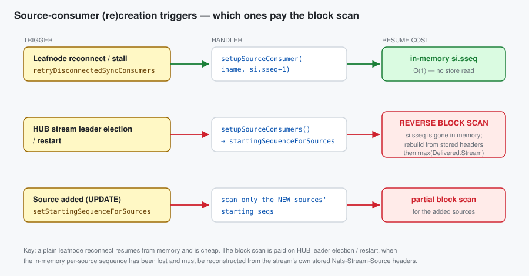
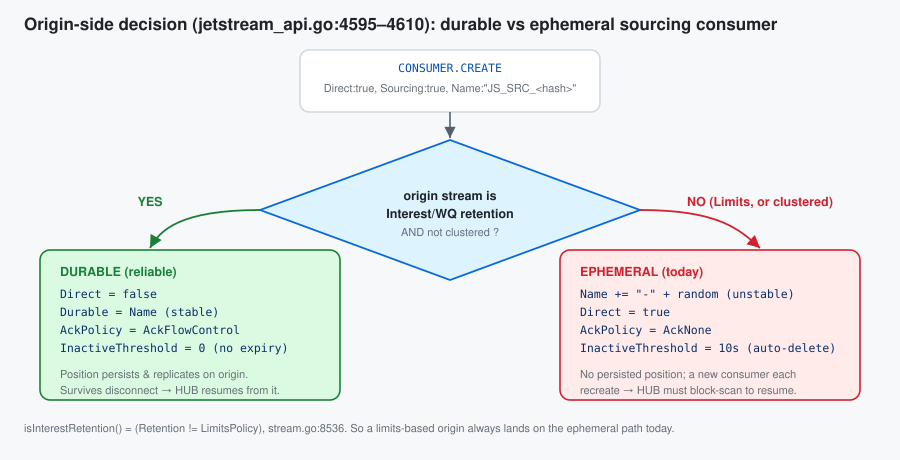
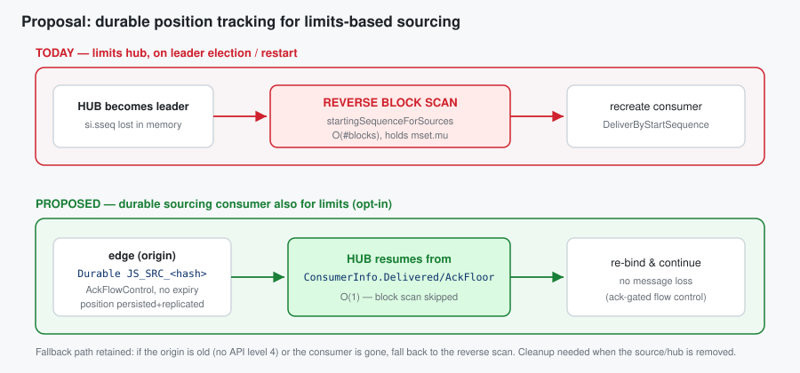

# Design Exploration: Source-consumer resume, the reverse block scan, and durable sourcing for limits streams

| | |
|---|---|
| **Status** | Exploration / Proposal |
| **Area** | JetStream stream sourcing (`server/stream.go`, `server/consumer.go`, `server/jetstream_api.go`, `server/leafnode.go`) |
| **Date** | 2026-06-06 |
| **Companion** | `stream-sourcing-scalability.md` (the O(S²) control-plane scans) |

> This doc is about a **different** scan from the companion doc. The companion is about an
> O(S²) walk over the *config slice*. This one is about the **reverse scan over the message store
> blocks** that runs when a source consumer is (re)created, why it exists, how the recently-added
> durable sourcing consumer avoids it, and how that could be extended to **limits-based** hub streams.

---

## 1. Summary

When a sourcing stream (re)creates its source consumers, it may **scan its own message store
backwards, block by block**, to reconstruct the last sequence it sourced from each origin
(`startingSequenceForSources`, `stream.go:4694`). On a large limits-based stream with many or *sparse*
sources, this can read — and decompress — a large fraction of the store, while holding `mset.mu`.

The 2.14 "reliable WQ/Interest sourcing" work (commit `8188ea9`, #7613) added a **durable sourcing
consumer** that persists its position on the origin and therefore lets the hub resume without the
block scan. But that durable path is gated to **Interest/WQ retention and non-clustered** origins
(`jetstream_api.go:4598`). **Limits-based** streams still get an ephemeral, auto-expiring consumer and
still pay the block scan.

This doc proposes extending durable position tracking to limits-based sourcing so the block scan
becomes a fallback rather than the norm.

---

## 2. When is a source consumer (re)created, and what does resume cost?

There are three distinct triggers, and they do **not** all pay the same price.



| Trigger | Path | Resume |
|---|---|---|
| **Leafnode reconnect / source stall** | `checkInternalSyncConsumers` (`leafnode.go:1730`, `2312`) → `retryDisconnectedSyncConsumers` (`stream.go:3013`) → `setupSourceConsumer(iname, si.sseq+1)` | from **in-memory** `si.sseq` — **O(1)**, no store read |
| **HUB stream leader election / restart** | `setupSourceConsumers` (`stream.go:4805`) → `startingSequenceForSources` (`4821`, **unconditional**) | **reverse block scan**, then `max(si.sseq, Delivered.Stream)` |
| **Source added via `STREAM.UPDATE`** | `setStartingSequenceForSources` (`stream.go:2578`) | partial block scan for the new sources |

So a **plain** leafnode reconnect (leadership unchanged) is cheap — the in-memory `si.sseq` is reused,
and at worst a fresh ephemeral consumer is created at `si.sseq+1`. The expensive scan is paid when the
in-memory per-source sequence is **gone** — i.e. on **leader election or restart** of the hub stream —
because `si.sseq` is **not persisted independently** anywhere (only the consumer's `Delivered.Stream`
on the origin is, §4).

Relevant timing constants (`stream.go:3062-3064`, `3425`): heartbeat `1s`, health/stall interval and
ephemeral `InactiveThreshold` `10s`, consumer-create wait `30s`.

---

## 3. The reverse block scan — what it does and why

`startingSequenceForSources` resets all source state, then walks the store **backwards from
`LastSeq`**, reading messages via `LoadPrevMsgMulti` and parsing the `Nats-Stream-Source`
(`JSStreamSource`) header to learn `(originStream, iname, originSeq)` for each. It stops once every
source has been located (or it hits the start of the stream).

```go
// stream.go:4690 — "This will do a reverse scan on startup or leader election ...
//                   This can be slow in degenerative cases."
for last := state.LastSeq; ; {
    sm, seq, err := mset.store.LoadPrevMsgMulti(sl, last, &smv) // walks blocks backward
    if err == ErrStoreEOF || err != nil { break }
    last = seq - 1
    ...
    streamName, iName, sseq := streamAndSeq(bytesToString(ss))
    update(iName, sseq)            // record this source's last sourced seq
    if len(seqs) == expected { return } // all sources found → stop early
}
```

Mechanically (`filestore.go:9403` `LoadPrevMsgMulti` → `prevMatchingMulti` → `cacheLookup`):

* it finds the block containing `last` and iterates **block indices downward** (`for i := bi; i >= 0; i--`);
* a block that is not cached is **read from disk, decrypted, and decompressed** before it can be
  searched (`loadMsgsWithLock`, `filestore.go:8407`);
* it returns the previous message matching the source sublist.


**Why it can be slow on a limits-based stream.** The scan can only stop when it has found the last
contribution of **every** source. A single **quiet/sparse** source (one that hasn't published
recently) forces the scan past every newer block to find its last message — worst case, the **entire
store**. With many sources and a large limits stream, a leader election triggers a long, block-loading,
`mset.mu`-holding scan.

**Why the scan exists at all.** The default sourcing consumer is `AckNone` + ephemeral
(§4). Its `Delivered.Stream` reflects what the origin *pushed*, which after a disconnect can be **ahead**
of what the hub actually *stored*. So the hub cannot trust the consumer alone; it reconstructs the
truth from its **own** stored `JSStreamSource` headers — that is exactly what the scan does. (After the
scan, `trySetupSourceConsumer` still takes `max(si.sseq, Delivered.Stream)` at `stream.go:4143`.)

---

## 4. The durable sourcing consumer (today) — and why limits is excluded

The default auto-created consumer (`trySetupSourceConsumer`, `stream.go:3939-3953`) is:

```go
Name: "JS_SRC_<stableHash>", Direct: true, Sourcing: true,
AckPolicy: AckNone, FlowControl: true, Heartbeat: 1s,
InactiveThreshold: sourceHealthCheckInterval /* 10s */,
```

On the **origin**, `jetstream_api.go:4595-4610` decides whether to *upgrade* that into a real durable:

```go
// "we need to 'upgrade' it to be durable without AckNone if not a Limits-based stream."
if req.Config.Direct && req.Config.Sourcing && req.Config.Name != _EMPTY_ {
    if !isClustered && stream.isInterestRetention() {        // WQ/Interest AND non-clustered
        req.Config.Direct = false
        req.Config.Durable = req.Config.Name                  // stable, persistent
        req.Config.AckPolicy = AckFlowControl                 // ack-gated → position is exact
        req.Config.InactiveThreshold = 0                      // never auto-deleted
    } else {                                                   // Limits, or clustered
        req.Config.Name = fmt.Sprintf("%s-%s", req.Config.Name, createConsumerName()) // random suffix
    }                                                          // stays Direct/AckNone/10s ephemeral
}
```



So:

* **Interest/WQ, non-clustered origin → durable.** `AckFlowControl` means the hub acks *after storing*,
  so the consumer's persisted floor equals what the hub confirmed. `InactiveThreshold:0` means it
  survives disconnects. On reconnect/election the hub re-binds (a `CONSUMER.RESET`, `stream.go:4017`)
  and resumes from `ConsumerInfo` — **no block scan needed**, and no message loss.
* **Limits, or clustered origin → ephemeral.** Random-suffixed name, `AckNone`, 10s `InactiveThreshold`.
  Nothing persists across a disconnect, so resume falls back to the reverse block scan.

`isInterestRetention()` is literally `Retention != LimitsPolicy` (`stream.go:8536`). Interest/WQ
*need* the durable consumer for correctness (to hold interest so the origin doesn't delete messages
before they are sourced); limits streams don't *need* it for correctness (messages aren't removed on
delivery, so the hub can always re-request), which is why it was scoped out — but they **do** pay the
block-scan cost as a result.

---

## 5. Proposal: durable position tracking for limits-based sourcing

Goal: make leader-election / restart resume **O(1)** for limits-based hub streams, instead of an
O(#blocks) reverse scan, by persisting the per-source position — ideally reusing the durable consumer
machinery that already exists.



### Option A (preferred) — extend the durable sourcing consumer to limits

Allow the origin-side upgrade for limits-based streams too, **opt-in**, producing a durable consumer
with `AckFlowControl` and `InactiveThreshold` long-but-finite:

* **What changes:** at `jetstream_api.go:4598`, relax the gate so limits origins can also become
  `Durable` + `AckFlowControl` (keeping the stable `JS_SRC_<hash>` name). The hub side already supports
  the reset/`AckFlowControl` path (`stream.go:4017`, `4118`).
* **Resume:** on election/restart, the hub re-binds and reads the consumer's confirmed position from
  `ConsumerInfo` (`stream.go:4143`); **skip `startingSequenceForSources`** when a valid durable
  consumer is found. Keep the scan as a fallback (old origin / consumer GC'd / API level < 4).
* **Why `AckFlowControl` (not `AckNone`) is required:** only an ack-gated floor reflects what the hub
  *stored*; `AckNone`'s `Delivered.Stream` can run ahead of the store and re-introduce the very
  ambiguity the scan was invented to resolve.

**Trade-offs / things to get right**

1. **Clustered origins.** Today durable is also disabled when the origin is clustered. A clustered edge
   needs the durable consumer raft-replicated and creates routed via the meta/stream leader
   (`jetstream_api.go:4402-4435`). This is the larger part of the work and can be a second phase.
2. **Consumer lifecycle / cleanup.** `InactiveThreshold:0` never expires, so a removed source or
   deleted hub stream must explicitly delete the origin consumer (`tryDeleteSourceConsumer`,
   `stream.go:2757` already exists). Safer middle ground for limits: a **long finite**
   `InactiveThreshold` (e.g. minutes) so an abandoned consumer is eventually GC'd, accepting a block
   scan only after a very long outage.
3. **Per-edge consumer count / storage.** One durable consumer per hub source on each edge. Usually
   fine; document the multiplier for large fan-ins.
4. **Flow-control overhead.** Ack-gated delivery adds a control round-trip vs `AckNone`. Acceptable for
   the reliability + fast-resume gain; should be benchmarked.

### Option B (complementary, smaller) — persist `si.sseq` on the hub

Independent of the origin's retention or clustering: **persist the per-source `iname → sseq` map** as
part of the hub stream's own state/snapshot, and load it on leader election/restart instead of
scanning. On restore from an older snapshot it may be stale, so still reconcile with
`max(persisted, Delivered.Stream)` and fall back to a (bounded) scan only when missing.

* **Pro:** works for limits *and* clustered with no origin-side changes; directly removes the scan.
* **Con:** new persisted/replicated state to version and keep consistent; doesn't add the
  no-loss/flow-control reliability that Option A brings.

### Recommendation

Pursue **Option A** for the reliability + resume win it gives limits sourcing (it reuses machinery that
already exists on the hub side), starting with the **non-clustered** origin case and a finite
`InactiveThreshold`; add **Option B** as a cheap, retention-agnostic safety net that also covers
clustered origins until Option A's clustered phase lands. In all cases the reverse scan stays as the
last-resort fallback.

---

## 6. Open questions

* Should durable-for-limits be **automatic** (whenever API level 4 is available) or an explicit
  `StreamSource`/stream option? Auto gives the win by default but changes resource usage on edges.
* For Option A, resume from `Delivered.Stream` or `AckFloor.Stream`? With `AckFlowControl` the
  **ack floor** is the safe "confirmed stored" watermark; `stream.go:4143` currently uses
  `Delivered.Stream` and would need review for the durable-limits case.
* Interaction with discard-new limits streams (the `TODO` at `stream.go:4440` about WQ-with-limit
  sourcing using flow control instead of re-creating the consumer) — Option A may subsume it.

---

## Appendix — key references

| Symbol | File:line | Role |
|---|---|---|
| `startingSequenceForSources` | `stream.go:4694` (comment `4690`) | the reverse block scan |
| `setupSourceConsumers` (unconditional scan call) | `stream.go:4805` / `4821` | leader-election / restart entry |
| `retryDisconnectedSyncConsumers` | `stream.go:3013` | reconnect/stall handler (in-memory resume) |
| `checkInternalSyncConsumers` | `leafnode.go:1730`, `2312`, `2318` | leafnode (re)connect trigger |
| `LoadPrevMsgMulti` | `filestore.go:9403` / `memstore.go:1991` | reverse block-walk primitive |
| `prevMatchingMulti` / `loadMsgsWithLock` | `filestore.go:3114` / `8407` | per-block load + decompress |
| `trySetupSourceConsumer` (consumer config) | `stream.go:3939-3953`, reset `4017`, AckFC check `4118` | hub-side setup |
| durable upgrade gate | `jetstream_api.go:4595-4610` | interest+non-clustered only |
| clustered sourcing routing | `jetstream_api.go:4394-4435` | meta/stream-leader handling |
| `isInterestRetention` | `stream.go:8536` | `Retention != LimitsPolicy` |
| `Sourcing` field | `consumer.go:129` | marks a sourcing consumer |
| `si.sseq` recovery | `stream.go:4143-4144` | `max(si.sseq, Delivered.Stream)` |
| durable sourcing commit | `8188ea9` (#7613) | "reliable WQ/Interest stream sourcing and mirroring" |
| reconnect storm fix | `7faace5` | "Source consumer reschedule storm on leafnode reconnect" |
