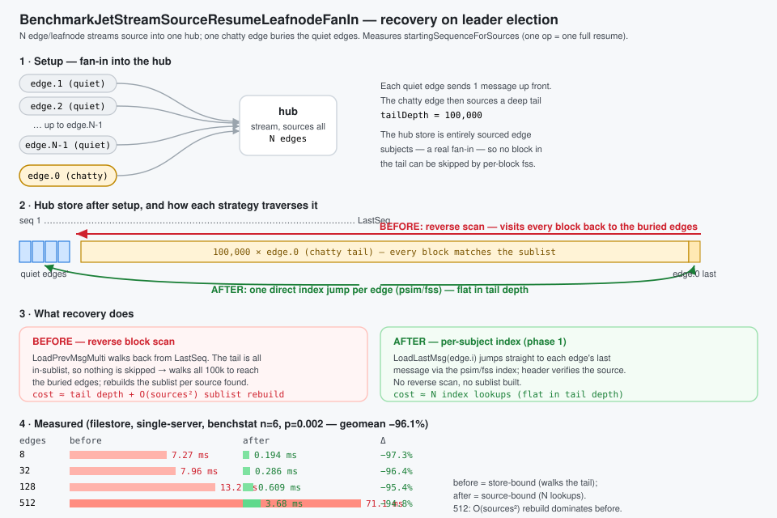
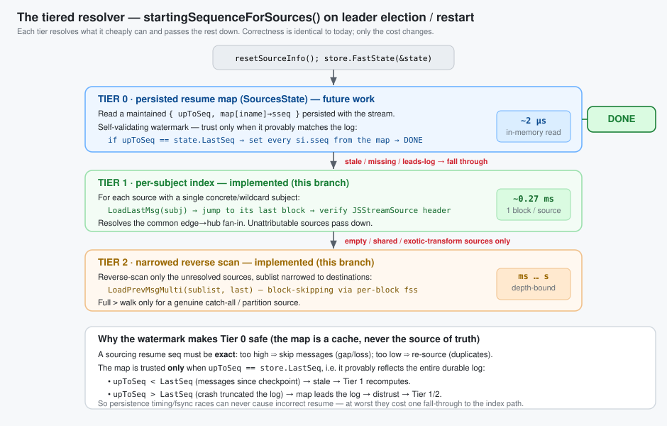
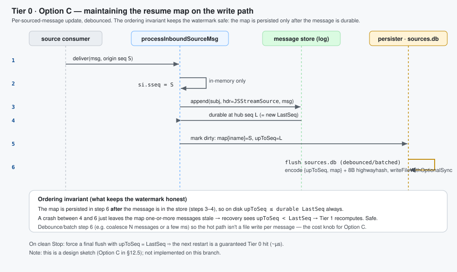

# Proposal: Replace the sourcing reverse block scan with an index lookup

| | |
|---|---|
| **Status** | Proposal |
| **Area** | JetStream stream sourcing (`server/stream.go`) + store index (`server/filestore.go`, `server/memstore.go`) |
| **Date** | 2026-06-06 |
| **Companion** | `sourcing-durable-resume.md` (lifecycle, durable consumer, triggers) |
| **Target** | `startingSequenceForSources` (`stream.go:4694`) and `setStartingSequenceForSources` (`stream.go:4566`) |

---

## 1. The problem in one paragraph

On hub-stream **leader election / restart**, `setupSourceConsumers` calls
`startingSequenceForSources` **unconditionally** (`stream.go:4821`). That function reconstructs each
source's last sourced sequence by walking the stream's **own store backwards from `LastSeq`**, one
block at a time (`LoadPrevMsgMulti`, `filestore.go:9425`), reading the `Nats-Stream-Source` header off
matching messages, until **every** source has been located.

> Note: the walk is not as naive as message-by-message — within each block the per-block index
> (`fss`) skips non-matching messages, and the per-source sublist narrows as sources are found. But
> `LoadPrevMsgMulti` still **visits every block** from `LastSeq` back to the match (loading/decompressing
> cold ones), and the outer loop **re-walks** as the sublist narrows. So the cost grows with both the
> number of blocks back to the least-recently-active source (worst case the **entire store**) and the
> number of sources — all under `mset.mu`.


## 2. The key insight

The store **already maintains a per-subject index** that can return the last sequence for a subject
*without* walking messages:

* `fs.psim` — per-subject info, including `lblk` = the **last block index** that contains each subject
  (`filestore.go:3843-3852`, `8980-8984`).
* `mb.fss` — per-block subject state with `Last` per subject (`filestore.go:9003-9015`).

This is what powers `LoadLastMsg(subject)` → `loadLast` (`filestore.go:8939`): for a literal subject it
jumps straight to `info.lblk` and reads that subject's last message — **one targeted block load**,
regardless of how far back it is. `MultiLastSeqs` (`filestore.go:3806`) does the same for a batch of
filters in a single index pass.

The current scan ignores this index and instead does a generic backward message walk. The header it
needs (the **origin** sequence) is right there in the message that `LoadLastMsg` already returns.

> Why a plain "last seq for subject" isn't enough on its own: `si.sseq` must be the **origin** stream
> sequence taken from the `Nats-Stream-Source` header, not the hub's storage sequence. So we use the
> index to *find* the source's last stored message in O(1), then read the origin seq from its header.

## 3. Background: the subject index (`psim` + `fss`) and the source header

The filestore keeps a **two-level subject index**. Phase 1 stands entirely on it, so it's worth being
precise about what each level is.


### 3.1 `psim` — the store-wide "which blocks hold this subject" map

`fs.psim` (`filestore.go:195`) is a `stree.SubjectTree[psi]` — a subject-token tree keyed by the full
message subject — whose value is a tiny per-subject record (`filestore.go:168`):

```go
type psi struct {
    total uint64  // how many messages exist for this subject across the whole stream
    fblk  uint32  // index of the FIRST block that still contains this subject
    lblk  uint32  // index of the LAST  block that still contains this subject
}
```

It is maintained incrementally on every write (`filestore.go:4933-4943`): on store, the subject's entry
is created (`total:1, fblk=lblk=current block`) or its `total` is bumped and `lblk` advanced to the
current block; on removal/expiry the counts and `fblk`/`lblk` are walked forward as blocks empty out.
Because `psim` is a *subject tree*, it supports both exact `Find(subject)` and wildcard `Match(filter)`
in time proportional to the subject token structure — **not** to the number of messages.

The single field that makes Phase 1 cheap is `lblk`: given a source's subject, `psim.Find` returns the
**exact last block** that contains it. There is no need to scan newer blocks — most of which don't
contain that subject at all. (`MultiLastSeqs`, `filestore.go:3806`, uses the same `psim` to answer a
*batch* of filters in one index pass.)

### 3.2 `fss` — the per-block "first/last seq of this subject in this block" map

`psim` gets us to a block; `mb.fss` (`filestore.go:239`) finishes the job *inside* that block. Each
`msgBlock` carries its own `stree.SubjectTree[SimpleState]` mapping subject → (`store.go:180`):

```go
type SimpleState struct {
    Msgs  uint64 // messages for this subject in THIS block
    First uint64 // first sequence for this subject in this block
    Last  uint64 // last  sequence for this subject in this block
    // (firstNeedsUpdate / lastNeedsUpdate: lazily recomputed when interior deletes invalidate them)
}
```

So the two levels compose into an O(1)-ish lookup, which is exactly what `loadLast`
(`filestore.go:8980-9034`) does:

```
psim.Find(subject) ─► info.lblk ─► block ─► block.fss.Find(subject) ─► ss.Last ─► load that one message
```

`fss` is what gives us the precise sequence within the block (and it correctly skips interior-deleted
messages via `lastNeedsUpdate`/`recalculateForSubj`). On a cold block, `ensurePerSubjectInfoLoaded`
loads/derives `fss` for that **one** block — the cost we pay once per resolved source, versus the
current scan paying it for every block back to the oldest source.


### 3.3 Why each message carries a `Nats-Stream-Source` header

`psim`/`fss` index by **subject**. They know nothing about *which source* produced a stored message or
*where in the origin stream* it came from — and those are precisely the two facts resume needs. That
information is carried only in the per-message header `Nats-Stream-Source` (`JSStreamSource`,
`stream.go:635`), written by `genSourceHeader` (`stream.go:4470`) as:

```
Nats-Stream-Source:  <idName>  <originSeq>  <filter>  <destination>  <origSubject>
                       │          │
                       │          └─ the ORIGIN stream's sequence — what we must resume from
                       └─ origin stream name (+ domain/consumer hash); with filter+dest it
                          reconstructs the source's full iname  (parsed by streamAndSeq, stream.go:4545)
```

This header is needed for three independent reasons:

1. **Source attribution.** A hub message is stored under its *destination* subject; the storage layer
   records nothing about its origin. When two sources can land on the same/overlapping subject, only the
   header's `iname` says which source a given message belongs to — hence Phase 1's
   `iname == si.iname` check.
2. **Origin-sequence tracking.** The sourcing consumer is (re)created on the **origin** with
   `DeliverByStartSequence`, which lives in the *origin's* sequence space. The hub's own storage
   sequence (e.g. 5123) is unrelated to the origin sequence (e.g. 482). Only the header preserves the
   origin sequence, so it is the *only* place a resume point can be recovered from without contacting
   the origin.
3. **Loop / daisy-chain handling & dedup.** When re-sourcing (A→B→C), `processInboundSourceMsg`
   strips the inbound `JSStreamSource` and stamps its own (`stream.go:4398`, `4405`), so each hop's
   provenance is well-defined and re-sourced duplicates can be recognised.

This is the crux of the whole proposal: **the index tells us *which block* in O(1); the header (read
from that one message) tells us *which source* and *which origin seq*.** Today's scan reads the header
off *every* message on the way back because it never consults `psim`/`fss` to jump directly to the right
one.

## 4. Proposed algorithm

Two phases. Phase 1 resolves the common case with index lookups; Phase 2 keeps today's scan only for
sources that genuinely can't be attributed by subject.


For each source, its **stored subject** is the `FilterSubject` for a plain source, or — for a source
with a **single, concrete (non-templated)** subject transform — the transform **Destination**.
Templated transform destinations contain `{{...}}` mapping tokens (the rendered subject varies per
message), and partial wildcards in a destination are rejected at config time, so a destination is
concrete unless it is empty, `>`, or contains `{{`.

```
Phase 1 — index lookup (per source, O(1) targeted load):
  for each source si:
      subj := si.FilterSubject                     // plain source
      if si has exactly one transform: subj := transform.Destination
      if subj == "" || subj == ">" || subj contains "{{":  defer to Phase 2; continue
      sm := store.LoadLastMsg(subj)                // jumps via psim, ~1 block
      if sm has a JSStreamSource header:
          (_, iname, sseq) := streamAndSeq(header)
          if iname == si.iname:                    // self-verifying attribution
              si.sseq = sseq; mark resolved
  // anything not resolved (no header / header for a different source / wildcard /
  //  multi-or-templated transform / pre-2.10) → Phase 2

Phase 2 — fallback reverse scan (only for the unresolved subset):
  run today's LoadPrevMsgMulti loop, but with the sublist built from ONLY the
  unresolved sources, so it narrows immediately and stops as soon as they are found.
```

The header check makes Phase 1 **self-correcting**: if a subject is shared between sources, or overlaps
a direct publish on the hub, or the last message has no source header, the lookup simply doesn't match
and that source drops to Phase 2 — never producing a wrong answer.

## 5. Before → after (code)

### Before (`startingSequenceForSources`, condensed — `stream.go:4694`)

```go
mset.resetSourceInfo()
// build a sublist of ALL sources' subjects
refreshSublist()                                   // every source
for last := state.LastSeq; ; {                     // walk the WHOLE store backwards
    sm, seq, err := mset.store.LoadPrevMsgMulti(sl, last, &smv) // loads/decompresses blocks
    if err == ErrStoreEOF || err != nil { break }
    last = seq - 1
    ...
    _, iName, sseq := streamAndSeq(bytesToString(ss))
    update(iName, sseq)                            // narrows sublist as sources are found
    if len(seqs) == expected { return }            // stop only when ALL sources found
}
```
**Cost:** O(blocks back to the least-recently-active source) block loads → worst case the entire store.

### After

```go
mset.resetSourceInfo()
var smv StoreMsg
unresolved := map[string]*sourceInfo{}

// Phase 1: targeted index lookup per source.
for _, ssi := range mset.cfg.Sources {
    si := mset.sources[ssi.iname]
    if si == nil { continue }
    var subj string                                // FilterSubject, or single concrete transform Destination
    switch {
    case len(ssi.SubjectTransforms) == 0: subj = ssi.FilterSubject
    case len(ssi.SubjectTransforms) == 1: subj = ssi.SubjectTransforms[0].Destination
    }
    if subj == _EMPTY_ || subj == fwcs || strings.Contains(subj, "{{") {
        unresolved[ssi.iname] = si                 // can't attribute by a single concrete subject
        continue
    }
    sm, err := mset.store.LoadLastMsg(subj, &smv)  // O(1) via psim/fss, returns header
    if err != nil || sm == nil || len(sm.hdr) == 0 {
        unresolved[ssi.iname] = si
        continue
    }
    if ss := sliceHeader(JSStreamSource, sm.hdr); len(ss) > 0 {
        if _, iName, sseq := streamAndSeq(bytesToString(ss)); iName == ssi.iname {
            si.sseq, si.dseq = sseq, 0             // verified — resolved without scanning
            continue
        }
    }
    unresolved[ssi.iname] = si
}

// Phase 2: only the leftovers pay the (now tiny) reverse scan.
if len(unresolved) > 0 {
    mset.reverseScanForSources(unresolved)         // = today's loop, scoped to this subset
}
```
**Cost:** Phase 1 = O(S) targeted lookups (recent sources share/cache the last block; a quiet source is
**one** targeted load, not a walk). Phase 2 only runs for ambiguous sources, with a smaller sublist.

> Multi-destination transform sources: call `LoadLastMsg` for each destination and keep the highest
> origin `sseq`, or defer them to Phase 2. Either is fine; deferring is simplest to start.

## 6. Before → after (complexity)

| | Before | After |
|---|---|---|
| Index used | none (generic message walk) | `psim` / `fss` per-subject last-block index |
| Blocks loaded | back to least-active source (≤ all blocks) | ~1 per source, only the blocks actually holding a source's last msg |
| Sensitivity to a **quiet** source | drags the scan back across the whole store | none — jumps straight to its block |
| Sensitivity to **store size** | linear in blocks scanned | none |
| Worst case still possible? | normal case | only if every source is `>`/wildcard/shared-subject/pre-2.10 (→ Phase 2 == today) |
| Held lock | `mset.mu` for the whole walk | `mset.mu` for O(S) lookups; Phase 2 only for leftovers |

The edge→hub topology (each edge mapped to a distinct subject/domain) lands entirely in Phase 1 → the
backward scan disappears for that case.

## 7. Phase 2: keeping the fallback scan narrow

Phase 1 removes most sources from the picture, but whatever remains still runs the reverse
`LoadPrevMsgMulti` scan. That scan's whole speed advantage depends on the **sublist being narrow** —
`prevMatchingMulti` uses each block's `fss` to skip blocks that contain none of the sublist's subjects.
A single `>` (full wildcard) in the sublist defeats that: it matches every subject, so no block can be
skipped and the scan visits every block back to the match.


### What used to inject `>`

1. **Every transform source.** A transform source has an empty `FilterSubject` (mutually exclusive with
   `SubjectTransforms`, `stream.go:1976`), so the old `refreshSublist` did `sl.Insert(fwcs)`. One
   transform source in the unresolved set widened the whole sublist to `>` → full backward scan.
2. **Templated transforms were deferred to Phase 2 at all.** Their *rendered* destination is a narrow
   wildcard (e.g. `tout.{{wildcard(1)}}` always lands on `tout.*`), so they don't need a full scan.
3. **Dead entries.** Phase 2 also inserted `si.sfs` — the transform *source* filters (e.g. `tin.*`) —
   which never match stored subjects (messages are stored under the *destination*).

### The two changes

* **Resolve wildcard transforms in Phase 1.** `transformUntokenize(dest)` collapses `wildcard()`/`$N`
  mapping tokens to a subject wildcard (`tout.{{wildcard(1)}}` → `tout.*`); `LoadLastMsg` accepts that
  wildcard and the header-`iname` check still guards attribution. So the common templated transforms
  resolve in Phase 1 and never reach the scan.
* **Build the Phase 2 sublist from destinations.** For any transform source that *does* reach Phase 2
  (e.g. its wildcard space is shared with another source, so Phase 1 saw a header for the other one),
  insert the destination's wildcard form instead of `>`, and drop the dead `si.sfs` inserts.

### What still forces `>` (by design)

Only a source that *genuinely* needs a broad match:

* a **catch-all source** — empty `FilterSubject`, no transform — sourcing every subject of its origin; and
* an **exotic transform** (`partition`/`split`/`slice`/…) whose rendered destination isn't a subject
  wildcard, so `transformUntokenize` can't reduce it (it leaves the `{{…}}` token in place, which we
  detect and fall back to `>`).

Both are uncommon for the edge→hub fan-in. Distinct subjects, wildcard filters, and `wildcard()`/`$N`
transforms all either resolve in Phase 1 or keep the Phase 2 sublist narrow enough to skip blocks.

> Correctness note: this is purely about *narrowing*, never about *missing* a source. If a narrowed
> subject is wrong (shared space), the header check fails and the source stays in the unresolved set; an
> exotic/empty case falls back to `>`. So Phase 2 still finds every source it did before — it just
> loads far fewer blocks getting there.

## 8. Correctness & edge cases

* **Same semantics.** Today's scan records, per source, the **most recent** stored message's origin seq
  (first hit scanning backward). `LoadLastMsg` returns exactly that message. Deleted/interior messages
  are handled by `loadLast` (it skips `dmap` entries and walks to the previous block if needed),
  matching the scan's behaviour.
* **Shared subjects / direct publishes.** Resolved safely by the header-iname verification → fall to
  Phase 2.
* **Wildcard / empty (`>`) filters.** Can't be attributed to one source by subject → Phase 2 (same as
  today for them).
* **Pre-2.10 headers** (no `iname`, only stream name): verification won't match → Phase 2, which keeps
  the existing stream-name matching path.
* **memstore.** `MemStore` has the simpler linear `LoadPrevMsgMulti`; `LoadLastMsg` there is also
  index-light, but memstore streams are small, so Phase 2 cost is negligible. (We can add a memstore
  `loadLast` fast path later if needed.)
* **`setStartingSequenceForSources`** (the `STREAM.UPDATE` path, `stream.go:4566`) gets the same Phase 1
  treatment for the subset of sources it processes.

## 9. Risks

* **Index freshness.** `psim`/`fss` may lazily need a recalculation (`lastNeedsUpdate`,
  `recalculateForSubj`); `loadLast`/`MultiLastSeqs` already handle that, so we inherit correct behaviour.
* **Behavioural parity.** Phase 1 must produce identical `si.sseq` to the old scan for non-ambiguous
  sources; this is the core test (below). Keeping Phase 2 byte-for-byte as today bounds the blast radius.
* **Encryption/compression.** Phase 1 still loads the one block holding a source's last message
  (decrypt/decompress), but only that block — no change in correctness, large reduction in volume.

## 10. Testing & validation

### Prototype status — implemented ✅

A working prototype of the two-phase resolver is implemented in `startingSequenceForSources`
(`server/stream.go`), with:

* `TestJetStreamStartingSequenceForSourcesIndexFastPath` (`server/jetstream_sourcing_resume_test.go`) —
  three distinct-subject sources (index fast path) plus one **subject-transform** source (phase 2
  fallback), each with a different origin depth and buried under 20k direct publishes. Asserts every
  recovered `si.sseq` equals the expected last origin sequence. **Passes.**
* `TestJetStreamStartingSequenceForSourcesAmbiguity` — a catch-all (empty filter) source and **two
  sources transformed onto the same destination subject** (shared stored subject), mixed with a
  distinct-subject source. Asserts the phase 2 fallback disambiguates all of them. **Passes.**
* `TestJetStreamSetStartingSequenceForSourcesIndex` — the same fast path applied to the
  `STREAM.UPDATE` twin `setStartingSequenceForSources` (distinct subject + catch-all + a
  **concrete-destination transform** source), clearing and recovering `sseq`. **Passes.**
* **Transform fast path:** a source with a single subject transform is resolved in Phase 1 by
  collapsing `wildcard()`/`$N` mapping tokens to a wildcard form (`transformUntokenize`, e.g.
  `tout.{{wildcard(1)}}` → `tout.*`) and doing `LoadLastMsg(wildcardForm)`, verified by the header.
  Only multi-transform and **exotic** transforms (`partition`/`split`/… that don't reduce to a subject
  wildcard) still defer to Phase 2.
* **Phase 2 no longer degrades to `>` for transform sources.** Previously a transform source (empty
  `FilterSubject`) inserted a `>` catch-all into the sublist, defeating per-block skipping for the whole
  scan. The Phase 2 sublist is now built from the transform **destinations** (wildcard form), with the
  dead `si.sfs` source-filter inserts removed; only a genuine catch-all source or an exotic transform
  still forces `>`.
* The change was also applied to `setStartingSequenceForSources` itself (`stream.go:4566`), so both the
  leader-election and the config-update resume paths use the index fast path and the narrowed sublist.
* Tests (all pass, incl. `-race`): `…IndexFastPath`, `…Ambiguity` (catch-all + shared concrete
  destination), `…TemplatedTransform` (wildcard transform), `…SharedWildcardTransform` (two templated
  transforms sharing a `gout.*` space), `TestJetStreamSetStartingSequenceForSourcesIndex` (twin),
  `TestJetStreamSourcingResumeAfterRolloutRestart` (end-to-end hard-restart, exactly-once resume),
  `TestJetStreamClusterSourcingResumeAfterLeaderStepDown` (R3 leader-election resume),
  `TestJetStreamStartingSequenceForSourcesDifferential` (randomized layouts vs. a brute-force reference),
  `…MemStore` (memory storage), `…PartitionTransform` (exotic `>` fallback), `…SeededEdges` (pre-2.10
  headers, subject overlap, interior delete), `…ConfigUpdateScoping` (update add/remove scoping), and
  `…FirstSeqAdvanced` (resume after `FirstSeq` advances).
* `BenchmarkJetStreamScanForSources` (existing, single source), `BenchmarkJetStreamScanForSourcesMulti`
  (16 sources spread across the store), `BenchmarkJetStreamSourceResumeLeafnodeFanIn` (8–512 edges
  feeding a hub, quiet edges buried under an all-sourced tail), `…FanInTailDepth` (fixed edges, varying
  tail depth — isolates the store-depth axis), `…PartitionFallback` (the by-design `>` path), and
  `…DeepStore` (direct store seeding up to 16/64/256 sources × 10M, for at-scale and cross-design
  comparison). See the tables below.
* Existing sourcing suite
  (`SourceBasics`, `SourceRemovalAndReAdd`, `WorkQueueSourceRestart`, `SourceWorkingQueueWithLimit`,
  `StreamSourceWithoutDuplicateWindow`, `MirrorAndSourcesFilteredConsumers`) still passes.

### Measured (filestore, single-server)

| Benchmark | Before (reverse scan) | After (phase 1) | Speedup |
|---|---|---|---|
| `ScanForSources` — 1 source, ~100k buried msgs | ~8.5 µs/op | ~5.5 µs/op | ~1.5× |
| `ScanForSourcesMulti` — 16 sources, spread | ~110.8 µs/op | ~14.0 µs/op | **~7.9×** |

The single-source gap is modest because `LoadPrevMsgMulti` already skips non-matching messages
per block; the win scales with the number of sources (each avoids a re-walk via a direct `psim` jump),
which is exactly the edge→hub fan-in case.

#### Leafnode fan-in resume (the leader-election case)

`BenchmarkJetStreamSourceResumeLeafnodeFanIn` models the scenario directly: a hub sources from *N*
edge/leafnode streams, then one chatty edge sources a deep 100k tail that buries the other edges' last
messages. Crucially the hub store is **entirely sourced edge subjects** — as a real fan-in is — so every
block matches the recovery sublist and *none* can be skipped. This is the work a freshly elected leader
runs (`startingSequenceForSources`) before it can resume sourcing. One op == one full recovery.




| edges | Before (reverse scan) | After (phase 1) | Δ |
|------:|----------------------:|----------------:|---|
| 8     | 7.27 ms ±96% | 0.194 ms ±23% | **−97.3%** |
| 32    | 7.96 ms ±6%  | 0.286 ms ±8%  | **−96.4%** |
| 128   | 13.2 ms ±6%  | 0.609 ms ±19% | **−95.4%** |
| 512   | 71.1 ms ±22% | 3.68 ms ±45%  | **−94.8%** |
| **geomean** | **15.3 ms** | **0.594 ms** | **−96.1%** |

*(filestore, single-server, `-benchtime=50x -count=6`, `benchstat`; all rows p=0.002 (n=6). Both columns
on the same shared host; "before" measured by splicing in the pre-optimization function from the parent
commit. The host is noisy — note the ±96% spread on the edges=8 "before" outlier — but the per-row deltas
and the −96.1% geomean are stable across runs.)*

Two effects compound, and the table separates them:

* **Store-bound vs source-bound.** "Before" carries a ~10 ms floor *independent of edge count* — it must
  reverse-scan the whole 100k tail to reach the buried quiet edges. "After" is flat in tail depth and
  scales only with edge count (one `LoadLastMsg` index jump each).
* **The O(sources²) sublist rebuild.** The old Phase 2 rebuilt the whole sublist on *every* source it
  resolved (`refreshSublist` per `update`). At 512 sources that is ~260k inserts per recovery — the
  "before" jumps to ~70–100 ms and (in a separate `-benchmem` run) **49.8 MB / 674k allocs/op**. Phase 1
  resolves these without ever building a sublist, so allocations drop to **2,572/op** — ~260× fewer at
  512 edges.

> Caveat: this is a micro-benchmark of the recovery function, not a full Raft election — an actual
> election adds a fixed quorum/round-trip cost on top of *both* columns equally. An earlier draft buried
> the edges under *direct* (non-sourced) hub traffic; there the old per-block `fss` skipping rescued the
> scan (only ~5×), which is not representative of a pure fan-in. The committed benchmark uses an
> all-sourced tail so nothing is skippable.

#### Isolating the store-depth axis

`BenchmarkJetStreamSourceResumeFanInTailDepth` fixes the edge count (32) and varies only the buried tail
depth. It makes the store-bound vs source-bound split explicit: the old scan grows linearly with depth
while Phase 1 stays flat, so the speedup *grows* with how deep the store is.

| tail depth | Before (reverse scan) | After (phase 1) | Speedup |
|-----------:|----------------------:|----------------:|--------:|
| 50k        | 0.89 ms  | 0.30 ms | 3.0× |
| 100k       | 11.6 ms  | 0.97 ms | 11.8× |
| 200k       | 23.1 ms  | 1.13 ms | 20.5× |
| 400k       | 46.0 ms  | 1.11 ms | 41.6× |

"Before" doubles with the tail (11.6 → 23.1 → 46.0 ms) — textbook O(depth). "After" is flat at ~1 ms and
its allocations stay at **~223/op** regardless of depth, versus ~3,400/op for the old scan. (The 50k
"before" is sub-linear because at that size the buried edges still sit within the first couple of blocks
the scan reaches; from 100k on, the linear walk dominates.)

#### At scale (10M), and vs. a persisted resume map

The **persisted-resume-map approach** (a separate effort; see §11) persists a `map[source]→lastSeq` and
*reads* it on recovery instead of recomputing from the store. To compare on the same axis,
`BenchmarkJetStreamSourceResumeDeepStore` seeds the hub store directly — real end-to-end sourcing can't
build a 10M-message store — with one `JSStreamSource`-headered anchor per source plus a deep tail, and a
built-in check verifies phase 1 resolves every source before timing. This pushes the reverse-scan
baseline to 10M:

| sources | tail | Before (reverse scan) | After (index recompute) | Speedup |
|--------:|-----:|----------------------:|------------------------:|--------:|
| 16  | 100k | 8.6 ms  | 0.265 ms | 33× |
| 16  | 1M   | 96.9 ms | 0.249 ms | 389× |
| 16  | 10M  | 972 ms  | 0.265 ms | 3,668× |
| 64  | 10M  | 974 ms  | 1.05 ms  | 928× |
| 256 | 10M  | 991 ms  | 3.08 ms  | 322× |

Both axes confirm the model: the reverse scan is O(depth) (8.6 → 97 → 972 ms across 100k → 1M → 10M) and
~flat in source count (it walks the whole tail regardless — 972/974/991 ms for 16/64/256 at 10M), while
the index recompute is flat in depth (~0.27 ms at 16 sources from 100k to 10M) and scales with source
count (~12 µs/source).

Cross-checking against the persisted-resume-map approach's published numbers (measured on a different
host with larger messages), at 16 sources / 10M tail — each row is one recovery strategy and the
benchmark it was measured in:

| recovery strategy | benchmark | recovery time |
|---|---|---:|
| reverse scan (pre-change baseline) | persisted-resume-map benchmark | 5.03 s |
| reverse scan (pre-change baseline) | `…DeepStore` (this proposal) | 0.972 s |
| index recompute (this proposal) | `…DeepStore` (this proposal) | 0.265 ms |
| persisted resume map | persisted-resume-map benchmark | 2.08 µs |

Both reverse-scan figures have the same O(depth) shape; the ~5× absolute gap between the two benchmarks is
environment (message size / host). The persisted resume map is ~100× faster than the index recompute *in
absolute terms* because it never touches the store — a pure in-memory read — whereas the index recompute
still loads one block per source. Those two factors compose to explain why the persisted-map benchmark's
headline multiplier (~2.4M×) dwarfs the index-recompute multiplier (~3,700×):
2.42M / 3,668 ≈ 660 ≈ 5.2 (baseline gap) × 127 (map-read vs one-block-load). The two approaches are
**complementary, not competing** — see §11.

### What still forces a full `>` scan in Phase 2 (by design)

After the above, Phase 2 only widens to `>` (no block skipping) when a source *genuinely* needs it:

* a **catch-all source** — empty `FilterSubject`, no transform — that sources every subject of its
  origin (it really can land anywhere, so a broad match is correct); and
* an **exotic transform** (`partition`/`split`/`slice`/…) whose rendered destination is not a subject
  wildcard, so `transformUntokenize` can't reduce it to a matchable pattern.

Both are uncommon for the edge→hub fan-in. Everything else — distinct subjects, wildcard filters,
`wildcard()`/`$N` transforms — either resolves in Phase 1 or narrows the Phase 2 sublist to a concrete
or wildcard subject.

`BenchmarkJetStreamSourceResumePartitionFallback` measures this residual path with a `partition()`
transform source (stored subjects `p.<n>`, which can't be reduced to a wildcard) alongside several
distinct edges (always resolved in Phase 1), over a deep 100k all-sourced store:

| placement of the `>` source | recovery | note |
|---|---:|---|
| **active** (it's the chatty aggregator, last msg at LastSeq) | 0.65 ms | the common case — the `>` scan resolves in O(1) despite the fallback |
| **buried** (quiet early, a distinct edge forms the tail)     | 56.2 ms | residual worst case — the `>` scan must walk the whole tail |

The takeaway: the by-design `>` fallback is cheap whenever the catch-all/partition source is *active*
(which is the normal state for an aggregator). It only degrades to a full scan when such a source is both
present **and** has gone quiet under a deep tail — genuinely unavoidable, since a catch-all source has no
single subject to index by. The distinct edges in the same stream are unaffected either way (Phase 1).

### Testing plan & coverage

The recovery path has two layers worth testing separately: the **resolver** (`startingSequenceForSources`
producing the right `si.sseq`) and the **end-to-end behaviour** (a real restart/election resumes sourcing
exactly-once). Below is the current coverage and the prioritized gaps.

**Layer 1 — resolver correctness (unit, calls the resolver directly).** ✅ in place:
`…IndexFastPath` (phase 1 + transform phase 2), `…Ambiguity` (catch-all + shared concrete destination),
`…SetStartingSequenceForSourcesIndex` (update-path twin), `…TemplatedTransform`, `…SharedWildcardTransform`.

**Layer 2 — end-to-end recovery.** Added: `TestJetStreamSourcingResumeAfterRolloutRestart` — sources
across both phases, hard-restarts the server (rolling-upgrade style), publishes a second batch, and asserts
each origin's sourced sequences are exactly `1..N` (no gap = no missed resume; no duplicate = no re-sourced
run). `TestJetStreamClusterSourcingResumeAfterLeaderStepDown` — the R3 equivalent: steps down the agg
leader so a new node runs the resolver, then asserts the same exactly-once property on the new leader.
Both pass under `-race`.

**Layer 1.5 — differential / property.** Added: `TestJetStreamStartingSequenceForSourcesDifferential` —
randomized layouts (mixed source kinds, random counts incl. zero, randomly interleaved depths) asserting
the resolver's per-source `sseq` equals an independent brute-force scan of the same store, over a set of
fixed reported seeds.

Prioritized gaps:

| Pri | Area | Proposed test(s) | Guards against |
|---|---|---|---|
| ~~P0~~ ✅ | Clustered resume (R3) | `…ResumeAfterLeaderStepDown` (added) | resolver runs per-node on every election |
| ~~P0~~ ✅ | Property / differential | `…Differential` (added) | resolver regressions the hand-written cases miss |
| ~~P1~~ ✅ | Store-state edges (seeded) | `…SeededEdges` (added): pre-2.10 headers, subject overlap, interior delete of a source's last message | the header-`iname` disambiguation, pre-2.10 name-match, and `loadLast`'s deleted-skip |
| ~~P1~~ ✅ | `memstore` path | `…MemStore` (added) | the linear `LoadPrevMsgMulti` / index-light `LoadLastMsg` path for sources |
| ~~P1~~ ✅ | Exotic transforms | `…PartitionTransform` (added) | the residual Tier 2 `>` path resolves to the right seq |
| ~~P2~~ ✅ | Config-update path | `…ConfigUpdateScoping` (added): add/remove sources, plus a direct assertion that only the given inames are recomputed | `setStartingSequenceForSources` scoping (the `needsStartingSeqNum` path) |
| ~~P2~~ ✅ | First-seq > 1 | `…FirstSeqAdvanced` (added): purge-by-sequence advances `FirstSeq`, both phases still resume | off-by-one in the reverse-scan / `loadLast` termination |
| P2 (covered) | Snapshot restore | shares the on-disk recovery path with `…ResumeAfterRolloutRestart`; a dedicated backup/restore round-trip remains optional | the cold-restore branch of recovery |

**Tier 0 (gated on implementation).** When the persisted map lands, add a watermark matrix:
`upToSeq == LastSeq` → trust; `upToSeq < LastSeq` → recompute (Tier 1); `upToSeq > LastSeq` → distrust;
plus checksum-corruption and version-mismatch → fall through (degrade, not error); a crash between message
durability and map flush → stale → Tier 1; clean `Stop` → Tier 0 hit; and a cluster snapshot round-trip.

### Still to do

* All P0–P2 recovery-test gaps are covered and green under `-race`. The only remaining additions are the
  **Tier 0 watermark matrix** (gated on that feature landing) and, optionally, a dedicated stream
  backup/restore round-trip (the resolver path itself is already exercised by the restart test).

### Resolved finding (was suspected pre-existing bug)

An earlier note suspected `setStartingSequenceForSources` mishandled transform sources because its
Phase 2 sublist used `si.sfs` (transform **source** filters) rather than the **destination**. On
inspection this was **not** a correctness bug: transform sources have an empty `FilterSubject`, so the
old sublist inserted a `>` catch-all that matched the destination anyway (verified by
`TestJetStreamStartingSequenceForSourcesTemplatedTransform`). It was purely an **efficiency** problem —
the `>` defeated block skipping — now fixed by building the Phase 2 sublist from the destination
wildcard form and dropping the dead `si.sfs` inserts.

## 11. Relationship to the durable-consumer proposal

This change is **orthogonal and complementary** to the durable-consumer/`si.sseq`-persistence ideas in
`sourcing-durable-resume.md`:

* Durable consumers / persisted `si.sseq` aim to **skip** resume work entirely (when state survives).
* This proposal makes the **fallback resume itself cheap** — which still runs on cold start, on
  snapshot restore, for limits/clustered streams, and any time persisted state is missing.

The two were measured head-to-head at 16 sources / 10M tail (see "At scale" above): a persisted resume
map reads in ~2 µs (pure in-memory, never touches the store), while the index recompute resolves in
~0.27 ms (one block load per source). Both are flat in store depth — versus ~1 s for the old reverse
scan. The persisted map is the faster steady-state path, but it buys that speed with a write-path cost
and a **new crash-consistency invariant**: the map must never lead durably-stored messages across
truncation, compaction, message deletion, snapshot restore, and follower replication, or recovery
resumes at a wrong sequence (gaps/duplicates). The index recompute carries none of that — the log plus
the existing subject index remain the only source of truth — so it is the natural path to run whenever
the persisted map is absent (pre-feature streams, cold start, restore) or must be revalidated.

Recommended order: land this index-based resume first (self-contained, no protocol/state change, helps
every retention type today, and replaces the O(depth) scan in the fallback the persisted design will
still need), then layer the persistence/durable improvements on top.

## 12. Design sketch: Tier 0, a persisted resume map

This section sketches how the persisted-map approach (a parallel effort) would slot in as **Tier 0** on
top of the resolver this branch already implements, what it buys, and the options/trade-offs for *where*
the map lives. Nothing here is implemented on this branch — it is the design we'd build the two efforts
toward.

### 12.1 The tiered resolver

`startingSequenceForSources` becomes three tiers, each resolving what it cheaply can and passing the
remainder down. Correctness is identical at every tier — only the cost changes.



| Tier | Mechanism | Resolves | Cost (16 src / 10M) | Status |
|---|---|---|---|---|
| **0** | read a persisted `{upToSeq, map[iname]→sseq}` | everything, if the map matches the log | ~2 µs | design |
| **1** | `LoadLastMsg(subj)` per source via the subject index | distinct concrete/wildcard-subject sources | ~0.27 ms | **this branch** |
| **2** | narrowed `LoadPrevMsgMulti` reverse scan | residual catch-all / exotic-transform sources | ms … s | **this branch** |

Tier 0 is a pure *fast path*: when present and trustworthy it returns immediately; otherwise the work
falls through to the index recompute (Tier 1) and, for the genuine residue, the narrowed scan (Tier 2).
Because Tiers 1–2 already exist and are cheap, Tier 0 can be added incrementally with no correctness risk
to the fallback.

### 12.2 How Tier 0 works

The per-source resume sequence (`si.sseq` — the origin sequence of the last message sourced from each
source) is already tracked in memory: it is set in `processInboundSourceMsg` (`stream.go`) as each
sourced message is ingested, and today it is **always recomputed** from the store on leader election
(`setLeader` → `setupSourceConsumers` → `startingSequenceForSources`). No source/mirror resume state is
persisted anywhere today.

Tier 0 persists that in-memory map so recovery can *read* it instead of recomputing:

1. **Maintain** `map[iname]→sseq` — already done; it is the set of `si.sseq` values.
2. **Persist** the map, tagged with a watermark `upToSeq` = the hub stream `LastSeq` the map reflects.
3. **On recovery**, load the map and decide whether to trust it (§12.4); on a hit, set every `si.sseq`
   from the map and return — no store access at all.

### 12.3 The consistency requirement (why a naive map is unsafe)

A sourcing resume sequence must be **exact**, not merely "not ahead":

* **Map too high** (claims a seq the store doesn't durably have — e.g. a crash truncated messages written
  after the last checkpoint) ⇒ we resume *past* real messages ⇒ **gap / data loss**.
* **Map too low** (stale — messages were sourced since the last checkpoint) ⇒ we re-request from the
  origin and re-append ⇒ **duplicates** (sourced messages carry no `Nats-Msg-Id`, so the store's dedupe
  does not catch them).

So "persist it and trust it" is only safe if the map is *exactly* the store's state — which is precisely
the crash-consistency burden a persisted map introduces, and why the state is recomputed today.

### 12.4 The watermark: self-validating trust

The cheap way to get exactness without per-source verification (which would just re-do Tier 1) is a
single **watermark**. Persist `upToSeq` alongside the map and, on recovery, compare it to the store's
actual `LastSeq`:

| Condition | Meaning | Action |
|---|---|---|
| `upToSeq == LastSeq` | map provably reflects the entire durable log | **trust it** — Tier 0 hit (~µs) |
| `upToSeq < LastSeq` | messages were stored after the checkpoint | stale → fall to Tier 1 |
| `upToSeq > LastSeq` | crash truncated the log below the checkpoint | map leads the log → distrust → Tier 1/2 |

This makes Tier 0 **safe by construction and independent of fsync timing**: if the last few sourced
messages weren't durable and are lost on restart, the recovered `LastSeq` is below `upToSeq`, the map is
distrusted, and Tier 1 recomputes. The worst case of *any* persistence race is one fall-through to the
index path — never an incorrect resume. The common clean-shutdown / steady-checkpoint case (the typical
restart and rolling-upgrade path) hits `upToSeq == LastSeq` and pays ~µs.

### 12.5 Where to persist the map — options

The map is tiny (`iname`→`uint64`, a few dozen entries), so the question is purely *where* it is written
to stay consistent and *how often*. Five options, roughly increasing in consistency strength and in
write-path / conflict cost:

| Option | Mechanism | Pros | Cons |
|---|---|---|---|
| **A. Inline in `index.db`** | encode the map inside the filestore full-state file (`_writeFullState` / `recoverFullState`) | atomic with stream state; one file; watermark = the state's `LastSeq` for free | touches the checksummed filestore format (highest conflict surface); only as fresh as the periodic full-state write |
| **B. Sidecar `sources.db`** | a small separate file in the stream's `msgs/` dir, mirroring the consumer-state file pattern (`encodeConsumerState` / `writeState` / highwayhash sum) | self-contained; no change to `index.db`; easy to version & checksum | a second file to write/sync and keep in step; its own staleness window |
| **C. Write-path update** | update + persist the map on every sourced message (the "always ~2 µs on recovery" design) | map is never stale (`upToSeq` ≈ `LastSeq` almost always) ⇒ Tier 0 hit even after a crash | per-message write amplification; needs batching/debounce; strongest crash-consistency coupling |
| **D. Periodic + on-stop** | snapshot `{LastSeq, map}` on a timer and on clean `Stop` | trivial; no write-path cost; on-stop write makes clean restarts a guaranteed Tier 0 hit | after a *crash*, almost always stale ⇒ falls to Tier 1 (still ~0.27 ms, so acceptable) |
| **E. RAFT snapshot (clustered)** | add the map to the stream's replicated snapshot encoding (`StreamReplicatedState` / `stateSnapshot`) | replicated to followers; survives leader change without a recompute | changes the replicated state format & version; must stay consistent across catchup/restore |

Notes:

* **A vs B vs D differ only in the staleness window**, and the watermark makes any window *safe* — it
  only affects the Tier 0 *hit rate*, not correctness. So a low-risk first cut is **D** (periodic +
  on-stop, sidecar file), upgrading to **C** later if steady-state recovery latency on crash matters.
* **C** is what yields the headline "~2 µs even after a crash," at the cost of touching the hot write
  path; it is the most invasive and the one most worth measuring for write-amplification. Its update
  sequence and the ordering invariant that keeps the watermark honest are shown below:



* **E** is orthogonal to A–D and is required for the *clustered* win — otherwise a clustered stream still
  recomputes (now via Tier 1) when a new leader has no local map. This is the largest piece and the one
  with the most format/version care.
* Whatever the choice, the map must be **bounded by `LastSeq` on read** (§12.4) and treated as a hint the
  log can always override.

### 12.6 Clustered streams

For replicated streams the resume state lives behind RAFT. Two sub-cases:

* **Same node re-elected / restarted** — a local sidecar/`index.db` map (A/B/D) applies as in the
  single-server case.
* **Different node becomes leader** — this is the *leader-election failover* case, and it is the one only
  option E helps. The new leader was a **follower**: it never ran the source consumers and never wrote a
  local map, so the local-file options (A/B/C/D) give it nothing — its watermark check can't pass and it
  falls through to Tier 1. Tier 1 keeps that fall-through cheap (~0.27 ms vs the old O(depth) scan), which
  is what makes Tier 0 *optional per node* rather than a hard dependency — but to get the ~µs Tier 0 hit
  on a freshly-elected node, the map has to be **replicated**, which is option E.

#### What option E involves

The replicated resume state rides the same RAFT machinery streams already use for catchup. The pieces:

1. **Carry the map in the replicated state.** Add a `Sources map[string]uint64` (iname→sseq) to
   `StreamReplicatedState` (`store.go:229`). The watermark is free: the snapshot is taken at a known
   `LastSeq`, which already lives in the same struct — so "map reflects the log up to `LastSeq`" needs no
   new field, just the §12.4 comparison on read.

2. **Encode/decode it.** Two strategies, trading conflict surface against simplicity:
   * **E1 — extend the binary stream-state format.** Append the map in `EncodedStreamState`
     (`filestore.go:12281`, `memstore.go:2369`) and read it in `DecodeStreamState` (`store.go:245`),
     behind a bumped `streamStateVersion`. Cleanest single blob, but touches the shared, version-checked
     stream-state codec (same high-conflict surface as option A — coordinate with whoever owns it).
   * **E2 — stream-layer envelope.** Leave the store codec untouched and have the stream append its own
     `SourcesState` block (the §12.9 encoding, reused verbatim) after the store's encoded state in
     `stateSnapshotLocked` (`jetstream_cluster.go:9905`), splitting it back off before
     `DecodeStreamState` on apply. Lower conflict surface; costs one extra length-prefix/parse step in the
     snapshot install/apply path.

3. **Populate on capture.** `stateSnapshotLocked` runs under the stream lock and already calls
   `EncodedStreamState`; it would read the live `si.sseq` values out of `mset.sources` there (they are the
   map). No new bookkeeping — the values already exist in memory on the leader.

4. **Apply on the receiving node.** When a node installs/applies the snapshot (`processSnapshot`,
   `jetstream_cluster.go:10264`, and the apply path that decodes it), stash the decoded map on the stream
   (e.g. `mset.snapSources`). Then Tier 0 in `startingSequenceForSources` reads that map and applies it
   **iff** its watermark `== state.LastSeq`, exactly as in §12.4.

5. **Keep it fresh past the snapshot (the real failover nuance).** A snapshot is point-in-time. After an
   election the new leader typically *catches up* by applying log entries written after the snapshot —
   advancing `LastSeq` beyond the snapshot's watermark, so a plain snapshot map is stale and Tier 0 misses
   (falling to Tier 1). To actually hit Tier 0 on failover, the map must also be advanced as those entries
   apply: when an applied entry is a sourced message (it carries the `JSStreamSource` header), bump
   `snapSources[iname] = sseq`. That is option **C**'s update, but driven off the **apply** stream rather
   than the live ingest path — so every replica maintains the map for free as it applies, and any one of
   them can become leader with a current map.

6. **Compatibility.** Version-gate both directions: a node reading a snapshot without the map (older
   peer, or first rollout) simply finds no `Sources` and falls through to Tier 1; a node that doesn't
   understand the new field must skip it cleanly. Because the watermark already makes a missing/stale map
   safe, mixed-version clusters degrade to the index recompute rather than mis-resuming — no flag-day.

Net: E is the largest and most consistency-sensitive option (it changes replicated state and rides the
catchup/apply path), but it is also the only one that makes a **freshly-elected leader** resume in ~µs.
Steps 1–4 give Tier 0 on a clean leader hand-off; step 5 is what extends it to a genuine failover with
catchup. Throughout, Tier 1 remains the fallback, so a missing, stale, or version-mismatched map only ever
costs a ~0.27 ms recompute — never a wrong resume.

### 12.7 Expected performance

From the measured numbers (§10, "At scale"), with 16 sources over a 10M-message store:

| Path | Recovery | Scales with | Flat in store depth? |
|---|---:|---|---|
| Old reverse scan (pre-branch) | ~0.97 s | store depth | no — O(depth) |
| Tier 1 index recompute (this branch) | ~0.27 ms | source count (~12 µs/src) | yes |
| Tier 0 persisted map (design) | ~2 µs (reported) | source count (~0.13 µs/src) | yes |

So Tier 0 is ~**100× faster than Tier 1 in absolute terms** (a pure in-memory read vs one block load per
source) and both are flat in depth. The practical question is whether ~0.27 ms recovery is already good
enough: for most deployments it is, and Tier 1 alone removes the multi-second cliff. Tier 0 earns its
keep when recovery happens *often* or with *many* sources — frequent leader elections / rolling restarts,
or hundreds–thousands of sources where 0.27 ms → tens of ms (Tier 1) is worth driving back to µs. It does
**not** change the asymptotics (both are O(sources)); it lowers the constant by removing store I/O.

### 12.8 Recommendation

1. **Ship Tiers 1–2 now** (this branch): self-contained, no new state, removes the O(depth) cliff for
   every retention type, and is the fallback Tier 0 needs anyway.
2. **Add Tier 0 incrementally**: start with option **D** (periodic + on-stop sidecar, watermark-validated)
   for single-server/R1 — small, safe, and already turns clean restarts into µs. Measure the write path
   before considering **C**.
3. **Then Tier 0 for clusters** (option **E**): the largest and most consistency-sensitive piece; gate it
   behind the same watermark and keep Tier 1 as the per-node fallback so it can never resume incorrectly.

### 12.9 Concrete encoding (`SourcesState`)

The map is small, so a flat varint encoding mirroring `encodeConsumerState` (`store.go:401`) is plenty.
It reuses the filestore conventions: a 2-byte header (`magic = 22`, `version = 1`, `hdrLen = 2`,
`filestore.go:288–294`) and an 8-byte trailing highwayhash-64 checksum over the preceding bytes
(`checksumSize = 8`, computed with the store's `fs.hh` digest as in `_writeFullState`).

Byte layout:

| Offset | Field | Type | Notes |
|---|---|---|---|
| `0` | `magic` | `u8` | `= 22` (filestore magic) |
| `1` | `version` | `u8` | `= 1` |
| `2…` | `upToSeq` | `uvarint` | hub `LastSeq` the map reflects — the watermark (§12.4) |
| `…` | `n` | `uvarint` | number of source entries |
| `…` | `len(iname)` | `uvarint` | ┐ repeated `n` times |
| `…` | `iname` | `bytes` | │ the source's unique index name |
| `…` | `sseq` | `uvarint` | ┘ last origin sequence sourced for it |
| *end−8* | `checksum` | `[8]byte` | highwayhash-64 over `buf[0 : end−8]` |

Encode (sketch):

```go
const sourcesStateMagic = magic // 22, shared filestore magic
const sourcesStateVersion = uint8(1)

// encodeSourcesState serializes {upToSeq, map[iname]→sseq}. hh is the store's
// keyed highwayhash digest (fs.hh); pass nil to skip the checksum (tests).
func encodeSourcesState(upToSeq uint64, seqs map[string]uint64, hh hash.Hash64) []byte {
	// Upper bound: header + upToSeq + count + per-entry(len + iname + sseq) + checksum.
	sz := hdrLen + 2*binary.MaxVarintLen64
	for iname := range seqs {
		sz += binary.MaxVarintLen64 + len(iname) + binary.MaxVarintLen64
	}
	sz += checksumSize
	buf := make([]byte, sz)

	buf[0], buf[1] = sourcesStateMagic, sourcesStateVersion
	n := hdrLen
	n += binary.PutUvarint(buf[n:], upToSeq)
	n += binary.PutUvarint(buf[n:], uint64(len(seqs)))
	for iname, sseq := range seqs {
		n += binary.PutUvarint(buf[n:], uint64(len(iname)))
		n += copy(buf[n:], iname)
		n += binary.PutUvarint(buf[n:], sseq)
	}
	if hh != nil {
		hh.Reset()
		hh.Write(buf[:n])
		n += copy(buf[n:], hh.Sum(nil)) // 8 bytes
	}
	return buf[:n]
}
```

Decode (sketch) — rejects a bad magic/version/checksum and returns the map plus the watermark, which
`startingSequenceForSources` (Tier 0) then compares against `state.LastSeq`:

```go
func decodeSourcesState(buf []byte, hh hash.Hash64) (upToSeq uint64, seqs map[string]uint64, err error) {
	if len(buf) < hdrLen+checksumSize || buf[0] != sourcesStateMagic || buf[1] != sourcesStateVersion {
		return 0, nil, errBadSourcesState
	}
	body, sum := buf[:len(buf)-checksumSize], buf[len(buf)-checksumSize:]
	if hh != nil {
		hh.Reset()
		hh.Write(body)
		if !bytes.Equal(hh.Sum(nil), sum) {
			return 0, nil, errBadSourcesState
		}
	}
	n := hdrLen
	upToSeq, c := binary.Uvarint(body[n:]); n += c
	cnt, c := binary.Uvarint(body[n:]); n += c
	seqs = make(map[string]uint64, cnt)
	for i := uint64(0); i < cnt; i++ {
		l, c := binary.Uvarint(body[n:]); n += c
		iname := string(body[n : n+int(l)]); n += int(l)
		sseq, c := binary.Uvarint(body[n:]); n += c
		seqs[iname] = sseq
	}
	return upToSeq, seqs, nil
}
```

Size: ~`len(iname)+~12` bytes per source, so a 256-source stream is well under 10 KB — a single small
write, well within one filesystem block for typical fan-ins. Forward compatibility is the usual `version`
bump (Tier 0 simply distrusts an unrecognized version and falls through to Tier 1, so an old/new format
mismatch degrades to the index recompute rather than an error).

The Tier 0 read in `startingSequenceForSources` is then small:

```go
// Tier 0: trust a persisted map only if it provably matches the durable log.
if buf, _ := mset.readSourcesState(); len(buf) > 0 {
	if upToSeq, seqs, err := decodeSourcesState(buf, mset.store.hh()); err == nil && upToSeq == state.LastSeq {
		for iname, sseq := range seqs {
			if si := mset.sources[iname]; si != nil {
				si.sseq, si.dseq = sseq, 0
			}
		}
		return // sources not in the map have never sourced → sseq stays 0 (correct)
	}
}
// else fall through to Tier 1 (index recompute) / Tier 2 (narrowed scan)
```

## Appendix — key references

| Symbol | File:line | Role |
|---|---|---|
| `startingSequenceForSources` | `stream.go:4694` | the scan to replace (Phase 1 + Phase 2) |
| unconditional call | `stream.go:4821` | runs on every leader election / restart |
| `setStartingSequenceForSources` | `stream.go:4566` | update-path twin, same treatment |
| sublist build (stored subjects) | `stream.go:4742-4757` | defines a source's stored subject(s) |
| `LoadLastMsg` / `loadLast` | `filestore.go:9048` / `8939` | index-based last-msg-for-subject (returns header) |
| `MultiLastSeqs` | `filestore.go:3806` | batched last-seq-per-filter via index |
| `psi` / `fs.psim` | `filestore.go:168` / `195` | per-subject `{total, fblk, lblk}`; store-wide subject→blocks index |
| `mb.fss` / `SimpleState` | `filestore.go:239` / `store.go:180` | per-block subject→`{Msgs, First, Last}` index |
| `psim` maintenance on write | `filestore.go:4933-4943` | how `total`/`lblk` are kept current |
| `LoadPrevMsgMulti` | `filestore.go:9403` / `memstore.go:1991` | the backward walk used by Phase 2 |
| `Nats-Stream-Source` header | `stream.go:635` | constant; the per-message source provenance |
| `genSourceHeader` / `streamAndSeq` | `stream.go:4470` / `4545` | writes / parses origin stream, iname, origin seq |

Tier 0 (design) persistence hooks:

| Symbol | File:line | Role |
|---|---|---|
| `processInboundSourceMsg` (`si.sseq = sseq`) | `stream.go:4371` | where the in-memory resume map is updated per sourced message |
| `setLeader` → `subscribeToStream` → `setupSourceConsumers` | `stream.go:1255` / `4957` / `4927` | the recovery trigger Tier 0 would short-circuit |
| `_writeFullState` / `recoverFullState` | `filestore.go:11681` / `1871` | filestore full-state write/read (`index.db`) — option A host |
| `encodeConsumerState` / `writeState` | `store.go:401` / `filestore.go:13164` | consumer-state file pattern to mirror for a sidecar `sources.db` (option B) |
| `StreamReplicatedState` / `stateSnapshot` | `store.go:229` / `jetstream_cluster.go:9897` | replicated stream state / snapshot — option E host (no source state today) |
| `EncodedStreamState` / `DecodeStreamState` | `filestore.go:12281`, `memstore.go:2369` / `store.go:245` | replicated-state codec to extend for option E1 (version-gated) |
| `stateSnapshotLocked` / `processSnapshot` | `jetstream_cluster.go:9905` / `10264` | snapshot capture (populate map) and apply (seed map + maintain from applied entries) for option E |
