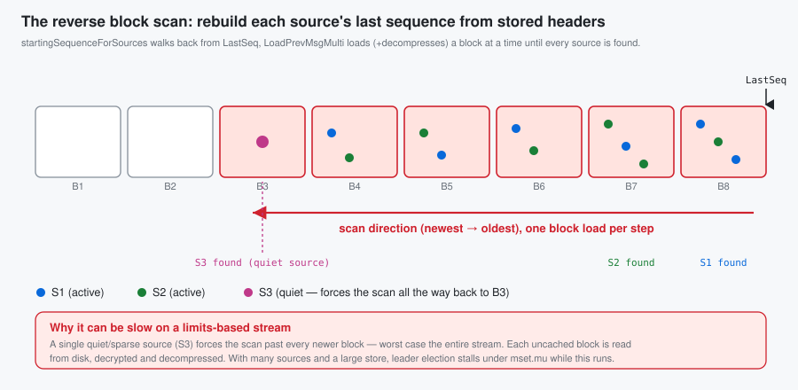
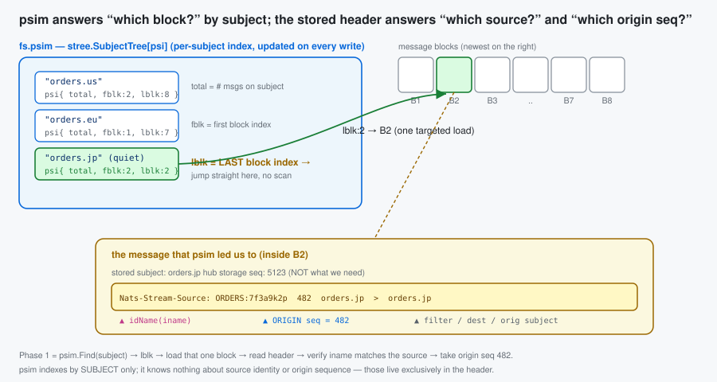
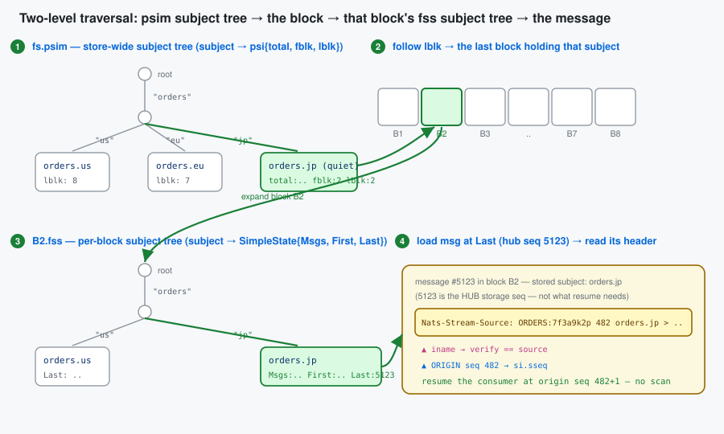
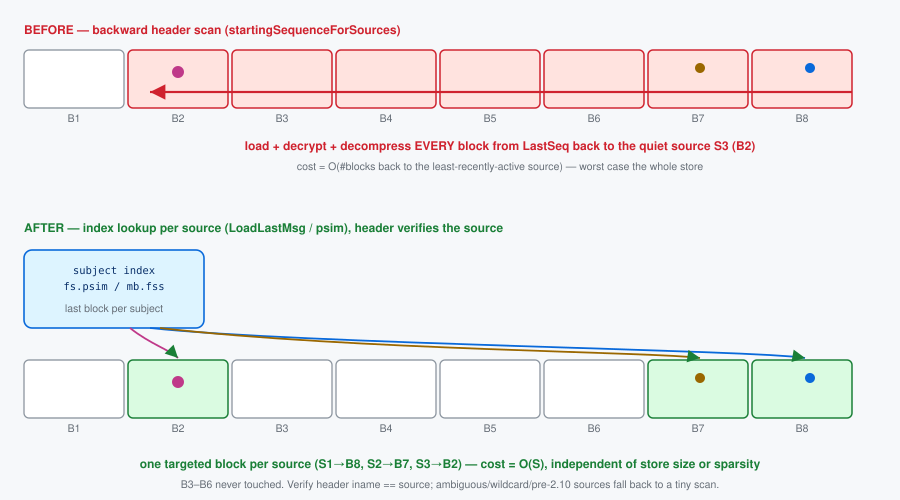
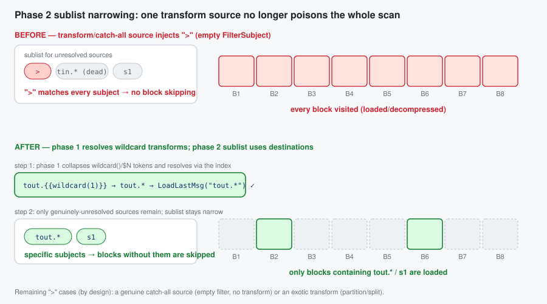

# Proposal: Replace the sourcing reverse block scan with an index lookup

| | |
|---|---|
| **Status** | Proposal |
| **Area** | JetStream stream sourcing (`server/stream.go`) + store index (`server/filestore.go`, `server/memstore.go`) |
| **Date** | 2026-06-06 |
| **Companion** | `sourcing-durable-resume.md` (lifecycle, durable consumer, triggers) |
| **Target** | `startingSequenceForSources` (`stream.go:4694`) and `setStartingSequenceForSources` (`stream.go:4566`) |

---

## 1. The problem in one paragraph

On hub-stream **leader election / restart**, `setupSourceConsumers` calls
`startingSequenceForSources` **unconditionally** (`stream.go:4821`). That function reconstructs each
source's last sourced sequence by walking the stream's **own store backwards from `LastSeq`**, one
block at a time (`LoadPrevMsgMulti`, `filestore.go:9425`), reading the `Nats-Stream-Source` header off
matching messages, until **every** source has been located.

> Note: the walk is not as naive as message-by-message — within each block the per-block index
> (`fss`) skips non-matching messages, and the per-source sublist narrows as sources are found. But
> `LoadPrevMsgMulti` still **visits every block** from `LastSeq` back to the match (loading/decompressing
> cold ones), and the outer loop **re-walks** as the sublist narrows. So the cost grows with both the
> number of blocks back to the least-recently-active source (worst case the **entire store**) and the
> number of sources — all under `mset.mu`.



## 2. The key insight

The store **already maintains a per-subject index** that can return the last sequence for a subject
*without* walking messages:

* `fs.psim` — per-subject info, including `lblk` = the **last block index** that contains each subject
  (`filestore.go:3843-3852`, `8980-8984`).
* `mb.fss` — per-block subject state with `Last` per subject (`filestore.go:9003-9015`).

This is what powers `LoadLastMsg(subject)` → `loadLast` (`filestore.go:8939`): for a literal subject it
jumps straight to `info.lblk` and reads that subject's last message — **one targeted block load**,
regardless of how far back it is. `MultiLastSeqs` (`filestore.go:3806`) does the same for a batch of
filters in a single index pass.

The current scan ignores this index and instead does a generic backward message walk. The header it
needs (the **origin** sequence) is right there in the message that `LoadLastMsg` already returns.

> Why a plain "last seq for subject" isn't enough on its own: `si.sseq` must be the **origin** stream
> sequence taken from the `Nats-Stream-Source` header, not the hub's storage sequence. So we use the
> index to *find* the source's last stored message in O(1), then read the origin seq from its header.

## 3. Background: the subject index (`psim` + `fss`) and the source header

The filestore keeps a **two-level subject index**. Phase 1 stands entirely on it, so it's worth being
precise about what each level is.



### 3.1 `psim` — the store-wide "which blocks hold this subject" map

`fs.psim` (`filestore.go:195`) is a `stree.SubjectTree[psi]` — a subject-token tree keyed by the full
message subject — whose value is a tiny per-subject record (`filestore.go:168`):

```go
type psi struct {
    total uint64  // how many messages exist for this subject across the whole stream
    fblk  uint32  // index of the FIRST block that still contains this subject
    lblk  uint32  // index of the LAST  block that still contains this subject
}
```

It is maintained incrementally on every write (`filestore.go:4933-4943`): on store, the subject's entry
is created (`total:1, fblk=lblk=current block`) or its `total` is bumped and `lblk` advanced to the
current block; on removal/expiry the counts and `fblk`/`lblk` are walked forward as blocks empty out.
Because `psim` is a *subject tree*, it supports both exact `Find(subject)` and wildcard `Match(filter)`
in time proportional to the subject token structure — **not** to the number of messages.

The single field that makes Phase 1 cheap is `lblk`: given a source's subject, `psim.Find` returns the
**exact last block** that contains it. There is no need to scan newer blocks — most of which don't
contain that subject at all. (`MultiLastSeqs`, `filestore.go:3806`, uses the same `psim` to answer a
*batch* of filters in one index pass.)

### 3.2 `fss` — the per-block "first/last seq of this subject in this block" map

`psim` gets us to a block; `mb.fss` (`filestore.go:239`) finishes the job *inside* that block. Each
`msgBlock` carries its own `stree.SubjectTree[SimpleState]` mapping subject → (`store.go:180`):

```go
type SimpleState struct {
    Msgs  uint64 // messages for this subject in THIS block
    First uint64 // first sequence for this subject in this block
    Last  uint64 // last  sequence for this subject in this block
    // (firstNeedsUpdate / lastNeedsUpdate: lazily recomputed when interior deletes invalidate them)
}
```

So the two levels compose into an O(1)-ish lookup, which is exactly what `loadLast`
(`filestore.go:8980-9034`) does:

```
psim.Find(subject) ─► info.lblk ─► block ─► block.fss.Find(subject) ─► ss.Last ─► load that one message
```

`fss` is what gives us the precise sequence within the block (and it correctly skips interior-deleted
messages via `lastNeedsUpdate`/`recalculateForSubj`). On a cold block, `ensurePerSubjectInfoLoaded`
loads/derives `fss` for that **one** block — the cost we pay once per resolved source, versus the
current scan paying it for every block back to the oldest source.



### 3.3 Why each message carries a `Nats-Stream-Source` header

`psim`/`fss` index by **subject**. They know nothing about *which source* produced a stored message or
*where in the origin stream* it came from — and those are precisely the two facts resume needs. That
information is carried only in the per-message header `Nats-Stream-Source` (`JSStreamSource`,
`stream.go:635`), written by `genSourceHeader` (`stream.go:4470`) as:

```
Nats-Stream-Source:  <idName>  <originSeq>  <filter>  <destination>  <origSubject>
                       │          │
                       │          └─ the ORIGIN stream's sequence — what we must resume from
                       └─ origin stream name (+ domain/consumer hash); with filter+dest it
                          reconstructs the source's full iname  (parsed by streamAndSeq, stream.go:4545)
```

This header is needed for three independent reasons:

1. **Source attribution.** A hub message is stored under its *destination* subject; the storage layer
   records nothing about its origin. When two sources can land on the same/overlapping subject, only the
   header's `iname` says which source a given message belongs to — hence Phase 1's
   `iname == si.iname` check.
2. **Origin-sequence tracking.** The sourcing consumer is (re)created on the **origin** with
   `DeliverByStartSequence`, which lives in the *origin's* sequence space. The hub's own storage
   sequence (e.g. 5123) is unrelated to the origin sequence (e.g. 482). Only the header preserves the
   origin sequence, so it is the *only* place a resume point can be recovered from without contacting
   the origin.
3. **Loop / daisy-chain handling & dedup.** When re-sourcing (A→B→C), `processInboundSourceMsg`
   strips the inbound `JSStreamSource` and stamps its own (`stream.go:4398`, `4405`), so each hop's
   provenance is well-defined and re-sourced duplicates can be recognised.

This is the crux of the whole proposal: **the index tells us *which block* in O(1); the header (read
from that one message) tells us *which source* and *which origin seq*.** Today's scan reads the header
off *every* message on the way back because it never consults `psim`/`fss` to jump directly to the right
one.

## 4. Proposed algorithm

Two phases. Phase 1 resolves the common case with index lookups; Phase 2 keeps today's scan only for
sources that genuinely can't be attributed by subject.



For each source, its **stored subject** is the `FilterSubject` for a plain source, or — for a source
with a **single, concrete (non-templated)** subject transform — the transform **Destination**.
Templated transform destinations contain `{{...}}` mapping tokens (the rendered subject varies per
message), and partial wildcards in a destination are rejected at config time, so a destination is
concrete unless it is empty, `>`, or contains `{{`.

```
Phase 1 — index lookup (per source, O(1) targeted load):
  for each source si:
      subj := si.FilterSubject                     // plain source
      if si has exactly one transform: subj := transform.Destination
      if subj == "" || subj == ">" || subj contains "{{":  defer to Phase 2; continue
      sm := store.LoadLastMsg(subj)                // jumps via psim, ~1 block
      if sm has a JSStreamSource header:
          (_, iname, sseq) := streamAndSeq(header)
          if iname == si.iname:                    // self-verifying attribution
              si.sseq = sseq; mark resolved
  // anything not resolved (no header / header for a different source / wildcard /
  //  multi-or-templated transform / pre-2.10) → Phase 2

Phase 2 — fallback reverse scan (only for the unresolved subset):
  run today's LoadPrevMsgMulti loop, but with the sublist built from ONLY the
  unresolved sources, so it narrows immediately and stops as soon as they are found.
```

The header check makes Phase 1 **self-correcting**: if a subject is shared between sources, or overlaps
a direct publish on the hub, or the last message has no source header, the lookup simply doesn't match
and that source drops to Phase 2 — never producing a wrong answer.

## 5. Before → after (code)

### Before (`startingSequenceForSources`, condensed — `stream.go:4694`)

```go
mset.resetSourceInfo()
// build a sublist of ALL sources' subjects
refreshSublist()                                   // every source
for last := state.LastSeq; ; {                     // walk the WHOLE store backwards
    sm, seq, err := mset.store.LoadPrevMsgMulti(sl, last, &smv) // loads/decompresses blocks
    if err == ErrStoreEOF || err != nil { break }
    last = seq - 1
    ...
    _, iName, sseq := streamAndSeq(bytesToString(ss))
    update(iName, sseq)                            // narrows sublist as sources are found
    if len(seqs) == expected { return }            // stop only when ALL sources found
}
```
**Cost:** O(blocks back to the least-recently-active source) block loads → worst case the entire store.

### After

```go
mset.resetSourceInfo()
var smv StoreMsg
unresolved := map[string]*sourceInfo{}

// Phase 1: targeted index lookup per source.
for _, ssi := range mset.cfg.Sources {
    si := mset.sources[ssi.iname]
    if si == nil { continue }
    var subj string                                // FilterSubject, or single concrete transform Destination
    switch {
    case len(ssi.SubjectTransforms) == 0: subj = ssi.FilterSubject
    case len(ssi.SubjectTransforms) == 1: subj = ssi.SubjectTransforms[0].Destination
    }
    if subj == _EMPTY_ || subj == fwcs || strings.Contains(subj, "{{") {
        unresolved[ssi.iname] = si                 // can't attribute by a single concrete subject
        continue
    }
    sm, err := mset.store.LoadLastMsg(subj, &smv)  // O(1) via psim/fss, returns header
    if err != nil || sm == nil || len(sm.hdr) == 0 {
        unresolved[ssi.iname] = si
        continue
    }
    if ss := sliceHeader(JSStreamSource, sm.hdr); len(ss) > 0 {
        if _, iName, sseq := streamAndSeq(bytesToString(ss)); iName == ssi.iname {
            si.sseq, si.dseq = sseq, 0             // verified — resolved without scanning
            continue
        }
    }
    unresolved[ssi.iname] = si
}

// Phase 2: only the leftovers pay the (now tiny) reverse scan.
if len(unresolved) > 0 {
    mset.reverseScanForSources(unresolved)         // = today's loop, scoped to this subset
}
```
**Cost:** Phase 1 = O(S) targeted lookups (recent sources share/cache the last block; a quiet source is
**one** targeted load, not a walk). Phase 2 only runs for ambiguous sources, with a smaller sublist.

> Multi-destination transform sources: call `LoadLastMsg` for each destination and keep the highest
> origin `sseq`, or defer them to Phase 2. Either is fine; deferring is simplest to start.

## 6. Before → after (complexity)

| | Before | After |
|---|---|---|
| Index used | none (generic message walk) | `psim` / `fss` per-subject last-block index |
| Blocks loaded | back to least-active source (≤ all blocks) | ~1 per source, only the blocks actually holding a source's last msg |
| Sensitivity to a **quiet** source | drags the scan back across the whole store | none — jumps straight to its block |
| Sensitivity to **store size** | linear in blocks scanned | none |
| Worst case still possible? | normal case | only if every source is `>`/wildcard/shared-subject/pre-2.10 (→ Phase 2 == today) |
| Held lock | `mset.mu` for the whole walk | `mset.mu` for O(S) lookups; Phase 2 only for leftovers |

The edge→hub topology (each edge mapped to a distinct subject/domain) lands entirely in Phase 1 → the
backward scan disappears for that case.

## 7. Phase 2: keeping the fallback scan narrow

Phase 1 removes most sources from the picture, but whatever remains still runs the reverse
`LoadPrevMsgMulti` scan. That scan's whole speed advantage depends on the **sublist being narrow** —
`prevMatchingMulti` uses each block's `fss` to skip blocks that contain none of the sublist's subjects.
A single `>` (full wildcard) in the sublist defeats that: it matches every subject, so no block can be
skipped and the scan visits every block back to the match.



### What used to inject `>`

1. **Every transform source.** A transform source has an empty `FilterSubject` (mutually exclusive with
   `SubjectTransforms`, `stream.go:1976`), so the old `refreshSublist` did `sl.Insert(fwcs)`. One
   transform source in the unresolved set widened the whole sublist to `>` → full backward scan.
2. **Templated transforms were deferred to Phase 2 at all.** Their *rendered* destination is a narrow
   wildcard (e.g. `tout.{{wildcard(1)}}` always lands on `tout.*`), so they don't need a full scan.
3. **Dead entries.** Phase 2 also inserted `si.sfs` — the transform *source* filters (e.g. `tin.*`) —
   which never match stored subjects (messages are stored under the *destination*).

### The two changes

* **Resolve wildcard transforms in Phase 1.** `transformUntokenize(dest)` collapses `wildcard()`/`$N`
  mapping tokens to a subject wildcard (`tout.{{wildcard(1)}}` → `tout.*`); `LoadLastMsg` accepts that
  wildcard and the header-`iname` check still guards attribution. So the common templated transforms
  resolve in Phase 1 and never reach the scan.
* **Build the Phase 2 sublist from destinations.** For any transform source that *does* reach Phase 2
  (e.g. its wildcard space is shared with another source, so Phase 1 saw a header for the other one),
  insert the destination's wildcard form instead of `>`, and drop the dead `si.sfs` inserts.

### What still forces `>` (by design)

Only a source that *genuinely* needs a broad match:

* a **catch-all source** — empty `FilterSubject`, no transform — sourcing every subject of its origin; and
* an **exotic transform** (`partition`/`split`/`slice`/…) whose rendered destination isn't a subject
  wildcard, so `transformUntokenize` can't reduce it (it leaves the `{{…}}` token in place, which we
  detect and fall back to `>`).

Both are uncommon for the edge→hub fan-in. Distinct subjects, wildcard filters, and `wildcard()`/`$N`
transforms all either resolve in Phase 1 or keep the Phase 2 sublist narrow enough to skip blocks.

> Correctness note: this is purely about *narrowing*, never about *missing* a source. If a narrowed
> subject is wrong (shared space), the header check fails and the source stays in the unresolved set; an
> exotic/empty case falls back to `>`. So Phase 2 still finds every source it did before — it just
> loads far fewer blocks getting there.

## 8. Correctness & edge cases

* **Same semantics.** Today's scan records, per source, the **most recent** stored message's origin seq
  (first hit scanning backward). `LoadLastMsg` returns exactly that message. Deleted/interior messages
  are handled by `loadLast` (it skips `dmap` entries and walks to the previous block if needed),
  matching the scan's behaviour.
* **Shared subjects / direct publishes.** Resolved safely by the header-iname verification → fall to
  Phase 2.
* **Wildcard / empty (`>`) filters.** Can't be attributed to one source by subject → Phase 2 (same as
  today for them).
* **Pre-2.10 headers** (no `iname`, only stream name): verification won't match → Phase 2, which keeps
  the existing stream-name matching path.
* **memstore.** `MemStore` has the simpler linear `LoadPrevMsgMulti`; `LoadLastMsg` there is also
  index-light, but memstore streams are small, so Phase 2 cost is negligible. (We can add a memstore
  `loadLast` fast path later if needed.)
* **`setStartingSequenceForSources`** (the `STREAM.UPDATE` path, `stream.go:4566`) gets the same Phase 1
  treatment for the subset of sources it processes.

## 9. Risks

* **Index freshness.** `psim`/`fss` may lazily need a recalculation (`lastNeedsUpdate`,
  `recalculateForSubj`); `loadLast`/`MultiLastSeqs` already handle that, so we inherit correct behaviour.
* **Behavioural parity.** Phase 1 must produce identical `si.sseq` to the old scan for non-ambiguous
  sources; this is the core test (below). Keeping Phase 2 byte-for-byte as today bounds the blast radius.
* **Encryption/compression.** Phase 1 still loads the one block holding a source's last message
  (decrypt/decompress), but only that block — no change in correctness, large reduction in volume.

## 10. Testing & validation

### Prototype status — implemented ✅

A working prototype of the two-phase resolver is implemented in `startingSequenceForSources`
(`server/stream.go`), with:

* `TestJetStreamStartingSequenceForSourcesIndexFastPath` (`server/jetstream_sourcing_resume_test.go`) —
  three distinct-subject sources (index fast path) plus one **subject-transform** source (phase 2
  fallback), each with a different origin depth and buried under 20k direct publishes. Asserts every
  recovered `si.sseq` equals the expected last origin sequence. **Passes.**
* `TestJetStreamStartingSequenceForSourcesAmbiguity` — a catch-all (empty filter) source and **two
  sources transformed onto the same destination subject** (shared stored subject), mixed with a
  distinct-subject source. Asserts the phase 2 fallback disambiguates all of them. **Passes.**
* `TestJetStreamSetStartingSequenceForSourcesIndex` — the same fast path applied to the
  `STREAM.UPDATE` twin `setStartingSequenceForSources` (distinct subject + catch-all + a
  **concrete-destination transform** source), clearing and recovering `sseq`. **Passes.**
* **Transform fast path:** a source with a single subject transform is resolved in Phase 1 by
  collapsing `wildcard()`/`$N` mapping tokens to a wildcard form (`transformUntokenize`, e.g.
  `tout.{{wildcard(1)}}` → `tout.*`) and doing `LoadLastMsg(wildcardForm)`, verified by the header.
  Only multi-transform and **exotic** transforms (`partition`/`split`/… that don't reduce to a subject
  wildcard) still defer to Phase 2.
* **Phase 2 no longer degrades to `>` for transform sources.** Previously a transform source (empty
  `FilterSubject`) inserted a `>` catch-all into the sublist, defeating per-block skipping for the whole
  scan. The Phase 2 sublist is now built from the transform **destinations** (wildcard form), with the
  dead `si.sfs` source-filter inserts removed; only a genuine catch-all source or an exotic transform
  still forces `>`.
* The change was also applied to `setStartingSequenceForSources` itself (`stream.go:4566`), so both the
  leader-election and the config-update resume paths use the index fast path and the narrowed sublist.
* Tests (all pass, incl. `-race`): `…IndexFastPath`, `…Ambiguity` (catch-all + shared concrete
  destination), `…TemplatedTransform` (wildcard transform), `…SharedWildcardTransform` (two templated
  transforms sharing a `gout.*` space), and `TestJetStreamSetStartingSequenceForSourcesIndex` (twin).
* `BenchmarkJetStreamScanForSources` (existing, single source), `BenchmarkJetStreamScanForSourcesMulti`
  (16 sources spread across the store), and `BenchmarkJetStreamSourceResumeLeafnodeFanIn` (8–512 edges
  feeding a hub, quiet edges buried under an all-sourced tail — see the fan-in table below).
* Existing sourcing suite
  (`SourceBasics`, `SourceRemovalAndReAdd`, `WorkQueueSourceRestart`, `SourceWorkingQueueWithLimit`,
  `StreamSourceWithoutDuplicateWindow`, `MirrorAndSourcesFilteredConsumers`) still passes.

### Measured (filestore, single-server)

| Benchmark | Before (reverse scan) | After (phase 1) | Speedup |
|---|---|---|---|
| `ScanForSources` — 1 source, ~100k buried msgs | ~8.5 µs/op | ~5.5 µs/op | ~1.5× |
| `ScanForSourcesMulti` — 16 sources, spread | ~110.8 µs/op | ~14.0 µs/op | **~7.9×** |

The single-source gap is modest because `LoadPrevMsgMulti` already skips non-matching messages
per block; the win scales with the number of sources (each avoids a re-walk via a direct `psim` jump),
which is exactly the edge→hub fan-in case.

#### Leafnode fan-in resume (the leader-election case)

`BenchmarkJetStreamSourceResumeLeafnodeFanIn` models the scenario directly: a hub sources from *N*
edge/leafnode streams, then one chatty edge sources a deep 100k tail that buries the other edges' last
messages. Crucially the hub store is **entirely sourced edge subjects** — as a real fan-in is — so every
block matches the recovery sublist and *none* can be skipped. This is the work a freshly elected leader
runs (`startingSequenceForSources`) before it can resume sourcing. One op == one full recovery.

| edges | Before (reverse scan) | After (phase 1) | Δ |
|------:|----------------------:|----------------:|---|
| 8     | 7.27 ms ±96% | 0.194 ms ±23% | **−97.3%** |
| 32    | 7.96 ms ±6%  | 0.286 ms ±8%  | **−96.4%** |
| 128   | 13.2 ms ±6%  | 0.609 ms ±19% | **−95.4%** |
| 512   | 71.1 ms ±22% | 3.68 ms ±45%  | **−94.8%** |
| **geomean** | **15.3 ms** | **0.594 ms** | **−96.1%** |

*(filestore, single-server, `-benchtime=50x -count=6`, `benchstat`; all rows p=0.002 (n=6). Both columns
on the same shared host; "before" measured by splicing in the pre-optimization function from the parent
commit. The host is noisy — note the ±96% spread on the edges=8 "before" outlier — but the per-row deltas
and the −96.1% geomean are stable across runs.)*

Two effects compound, and the table separates them:

* **Store-bound vs source-bound.** "Before" carries a ~10 ms floor *independent of edge count* — it must
  reverse-scan the whole 100k tail to reach the buried quiet edges. "After" is flat in tail depth and
  scales only with edge count (one `LoadLastMsg` index jump each).
* **The O(sources²) sublist rebuild.** The old Phase 2 rebuilt the whole sublist on *every* source it
  resolved (`refreshSublist` per `update`). At 512 sources that is ~260k inserts per recovery — the
  "before" jumps to ~70–100 ms and (in a separate `-benchmem` run) **49.8 MB / 674k allocs/op**. Phase 1
  resolves these without ever building a sublist, so allocations drop to **2,572/op** — ~260× fewer at
  512 edges.

> Caveat: this is a micro-benchmark of the recovery function, not a full Raft election — an actual
> election adds a fixed quorum/round-trip cost on top of *both* columns equally. An earlier draft buried
> the edges under *direct* (non-sourced) hub traffic; there the old per-block `fss` skipping rescued the
> scan (only ~5×), which is not representative of a pure fan-in. The committed benchmark uses an
> all-sourced tail so nothing is skippable.

### What still forces a full `>` scan in Phase 2 (by design)

After the above, Phase 2 only widens to `>` (no block skipping) when a source *genuinely* needs it:

* a **catch-all source** — empty `FilterSubject`, no transform — that sources every subject of its
  origin (it really can land anywhere, so a broad match is correct); and
* an **exotic transform** (`partition`/`split`/`slice`/…) whose rendered destination is not a subject
  wildcard, so `transformUntokenize` can't reduce it to a matchable pattern.

Both are uncommon for the edge→hub fan-in. Everything else — distinct subjects, wildcard filters,
`wildcard()`/`$N` transforms — either resolves in Phase 1 or narrows the Phase 2 sublist to a concrete
or wildcard subject.

### Still to do

* **Pre-2.10 / direct-publish-overlap coverage:** add explicit cases (handled today via the header
  check and the Phase 2 fallback; tests would lock the behaviour in). Hard to construct through the JS
  client because streams can't declare overlapping subjects; would need low-level store seeding.
* A `partition`/`split` transform benchmark to confirm the (rare) `>` path is acceptable.

### Resolved finding (was suspected pre-existing bug)

An earlier note suspected `setStartingSequenceForSources` mishandled transform sources because its
Phase 2 sublist used `si.sfs` (transform **source** filters) rather than the **destination**. On
inspection this was **not** a correctness bug: transform sources have an empty `FilterSubject`, so the
old sublist inserted a `>` catch-all that matched the destination anyway (verified by
`TestJetStreamStartingSequenceForSourcesTemplatedTransform`). It was purely an **efficiency** problem —
the `>` defeated block skipping — now fixed by building the Phase 2 sublist from the destination
wildcard form and dropping the dead `si.sfs` inserts.

## 11. Relationship to the durable-consumer proposal

This change is **orthogonal and complementary** to the durable-consumer/`si.sseq`-persistence ideas in
`sourcing-durable-resume.md`:

* Durable consumers / persisted `si.sseq` aim to **skip** resume work entirely (when state survives).
* This proposal makes the **fallback resume itself cheap** — which still runs on cold start, on
  snapshot restore, for limits/clustered streams, and any time persisted state is missing.

Recommended order: land this index-based resume first (self-contained, no protocol/state change, helps
every retention type today), then layer the persistence/durable improvements on top.

## Appendix — key references

| Symbol | File:line | Role |
|---|---|---|
| `startingSequenceForSources` | `stream.go:4694` | the scan to replace (Phase 1 + Phase 2) |
| unconditional call | `stream.go:4821` | runs on every leader election / restart |
| `setStartingSequenceForSources` | `stream.go:4566` | update-path twin, same treatment |
| sublist build (stored subjects) | `stream.go:4742-4757` | defines a source's stored subject(s) |
| `LoadLastMsg` / `loadLast` | `filestore.go:9048` / `8939` | index-based last-msg-for-subject (returns header) |
| `MultiLastSeqs` | `filestore.go:3806` | batched last-seq-per-filter via index |
| `psi` / `fs.psim` | `filestore.go:168` / `195` | per-subject `{total, fblk, lblk}`; store-wide subject→blocks index |
| `mb.fss` / `SimpleState` | `filestore.go:239` / `store.go:180` | per-block subject→`{Msgs, First, Last}` index |
| `psim` maintenance on write | `filestore.go:4933-4943` | how `total`/`lblk` are kept current |
| `LoadPrevMsgMulti` | `filestore.go:9403` / `memstore.go:1991` | the backward walk used by Phase 2 |
| `Nats-Stream-Source` header | `stream.go:635` | constant; the per-message source provenance |
| `genSourceHeader` / `streamAndSeq` | `stream.go:4470` / `4545` | writes / parses origin stream, iname, origin seq |
