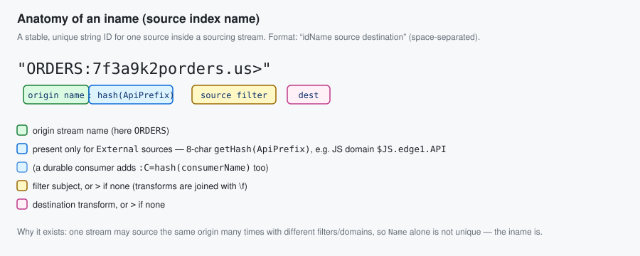
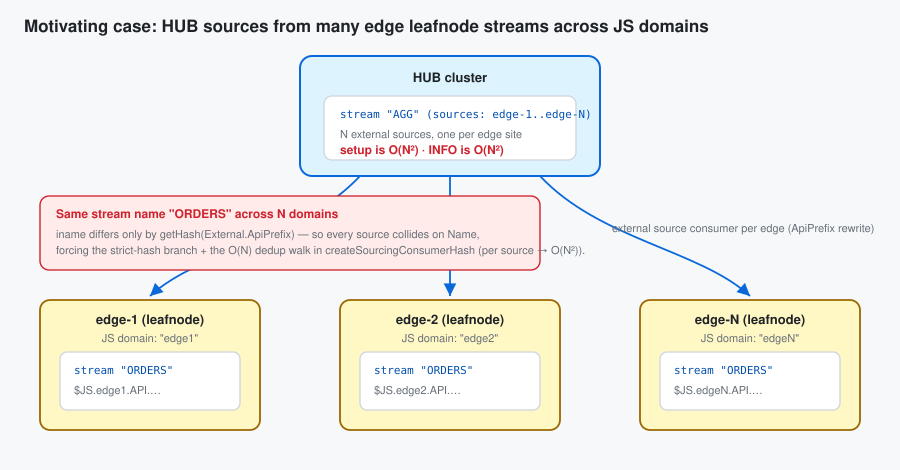
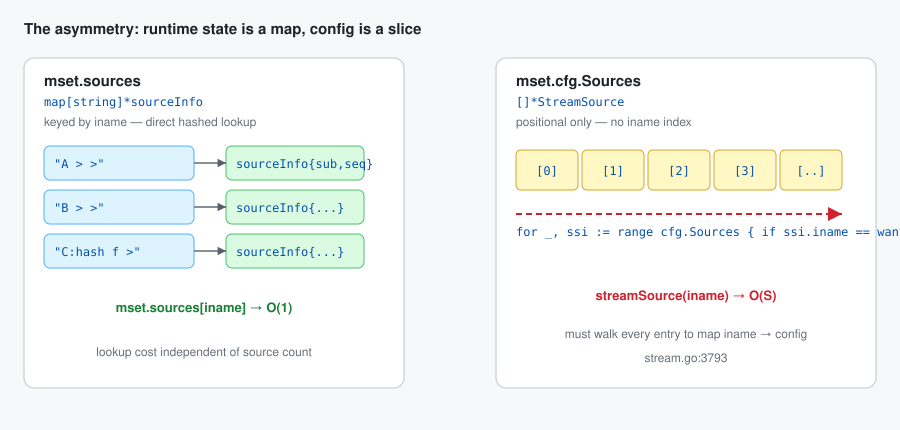
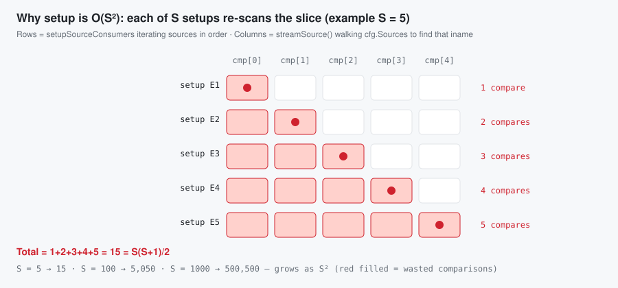
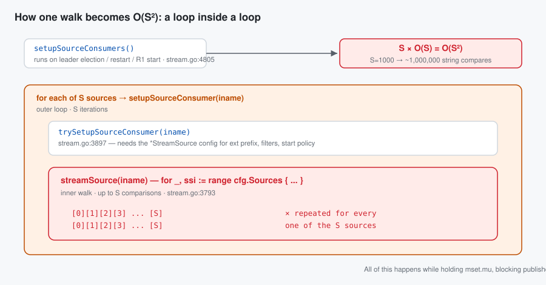
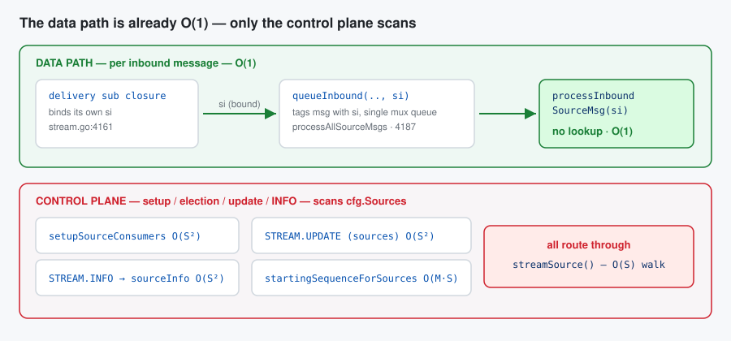
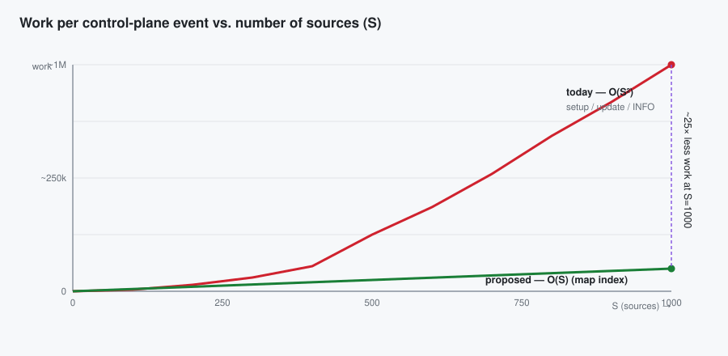
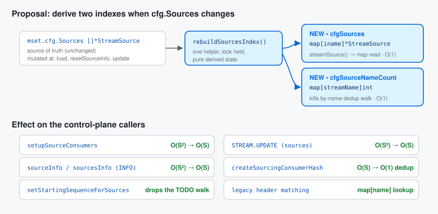

# Design Proposal: Scaling JetStream Stream Sourcing

| | |
|---|---|
| **Status** | Draft / Proposal |
| **Area** | JetStream — stream sourcing (`server/stream.go`, `server/consumer.go`) |
| **Author** | source-consumers-linear-scan investigation |
| **Date** | 2026-06-06 |
| **Related** | `jetstream_sourcing_scaling_test.go`, report `docs/reports/source-consumers-linear-scan.html` |

---

## 1. Summary

JetStream stream **sourcing** scales poorly in the number of configured sources `S`. Several
control-plane operations — consumer setup on leader election/restart, `STREAM.UPDATE`, and
`STREAM.INFO` — are **O(S²)**: they map a source *index name* (`iname`) back to its `*StreamSource`
config through a linear walk (`stream.streamSource()`, `stream.go:3793`) that is itself called once
per source.

The message **data path is already O(1)** and is unchanged by this proposal.

We propose two small derived indexes alongside `cfg.Sources` so that `iname → config` and
`streamName → count` become O(1). That collapses the affected operations from O(S²) to O(S) with no
behaviour change, no wire/disk/config change, and no migration.

---

## 2. First, what is an `iname`?

An **`iname`** ("index name") is a **stable, unique string identifier for one source *within* a
sourcing stream**. It is built by `composeIName()` (`stream.go:1079`) and used as the key of the
runtime map `mset.sources[iname]` and to correlate inbound messages/headers back to their source.



It is the concatenation of three space-separated parts — `idName  source  destination`:

| Part | Comes from | Notes |
|---|---|---|
| `idName` | `Name` `[+ ":" + getHash(External.ApiPrefix)]` `[+ ":C=" + getHash(Consumer.Name)]` | the origin stream, plus an 8-char hash of the JS-domain API prefix for **external** sources, plus a durable-consumer hash if pinned |
| `source` | `FilterSubject`, or `>` if empty | for multi-transform sources, the transform *sources* joined by `\f` |
| `destination` | transform destination, or `>` if none | |

**Worked examples** (`getHash` returns 8 base-36 chars; shown here as `7f3a9k2p`):

| Source config | `iname` |
|---|---|
| `Name:"ORDERS"`, no filter, no transform, local | `ORDERS > >` |
| `Name:"ORDERS"`, `FilterSubject:"orders.us"` | `ORDERS orders.us >` |
| `Name:"ORDERS"`, `External.ApiPrefix:"$JS.edge1.API"` | `ORDERS:7f3a9k2p > >` |
| same name on a *different* edge domain `$JS.edge2.API` | `ORDERS:q1w2e3r4 > >` |

> **Why it exists:** one stream may source the *same* origin stream multiple times with different
> filters, transforms, or JS domains. `Name` alone is therefore not unique — the `iname` is. (The
> test at `norace_2_test.go:1016` looks up `mset.sources["TEST > >"]`, confirming the format.)

The whole performance problem is just this: the runtime state is **keyed by `iname` in a map**, but
the *config* it points back to lives in a **slice with no `iname` key**.

---

## 3. Motivating scenario

> A JetStream instance runs on an **edge leafnode site** with a stream in its own **JS domain**.
> From the **HUB** side we create a stream that **sources** from that edge leafnode stream — repeated
> across many edge sites.



This is the worst case because **every** source is *external* (a per-domain `ApiPrefix` such as
`$JS.edge1.API.>`), so every setup/INFO/update call has to resolve `iname → *StreamSource` to read
that prefix — driving it straight through the O(S²) paths below. The shared name `ORDERS` across
domains is fine for correctness (the domain hash in the `iname` disambiguates it), but it means the
slice is full of look-alike entries that the linear walk cannot shortcut.

---

## 4. Root cause: a map on one side, a slice on the other



```go
// stream.go:515 — runtime state, keyed by iname → O(1)
sources map[string]*sourceInfo

// cfg.Sources — the CONFIG, a flat slice, no iname index → O(S) to find one
Sources []*StreamSource
```

So the single helper that maps `iname → config` must scan:

```go
// stream.go:3793
func (mset *stream) streamSource(iname string) *StreamSource {
    for _, ssi := range mset.cfg.Sources { // O(S)
        if ssi.iname == iname {
            return ssi
        }
    }
    return nil
}
```

---

## 5. Why that is O(S²) — a worked example

`streamSource()` alone is O(S). It becomes O(S²) because it is called **once per source from inside a
loop that already visits every source**. Walk through `setupSourceConsumers` with `S = 5`
(edge sources `E1..E5`):

* The outer loop iterates the slice in order: `E1, E2, E3, E4, E5`.
* For each, it calls `setupSourceConsumer(iname)` → `trySetupSourceConsumer` → `streamSource(iname)`,
  which **re-walks the slice from the front** to find that same `iname`.
* `E1` is found after 1 compare, `E2` after 2, … `E5` after 5.



Total compares = `1 + 2 + 3 + 4 + 5 = 15 = S(S+1)/2`. That triangular sum is **O(S²)**:

| S | compares (`S(S+1)/2`) |
|---|---|
| 5 | 15 |
| 100 | 5,050 |
| 1000 | **500,500** |

And `setupSourceConsumers` is only one of several O(S²) callers — combined, a single leader election
on a 1000-source hub stream is on the order of **a million** string comparisons, all under `mset.mu`.



### What is *not* affected

The inbound data path stays O(1): each source's delivery subscription closes over its own `si`
(`stream.go:4161`) and passes it straight to `processInboundSourceMsg(si, …)` (`stream.go:4314`). No
lookup per message.



---

## 6. The affected operations — before → after

Each subsection shows the operation, why it is quadratic today, and what it becomes with the proposed
indexes (defined in §7).

### 6.1 `setupSourceConsumers` — leader election / restart / R1 start

**Before — O(S²)** (`stream.go:4805`, `4811`, `3911`)

```go
for _, ssi := range mset.cfg.Sources {                 // S iterations
    if si := mset.sources[ssi.iname]; si != nil {
        mset.setupSourceConsumer(ssi.iname, si.sseq+1, ...) // → trySetupSourceConsumer
    }
}
// inside trySetupSourceConsumer (stream.go:3911):
ssi := mset.streamSource(iname)                        // O(S) walk, per source
```
Cost at S=1000: ≈ 500,500 compares per election.

**After — O(S)**
```go
// streamSource() is now a map read; the loop body is O(1).
ssi := mset.streamSource(iname)   // mset.cfgSources[iname]
```
Cost at S=1000: 1000 map reads.

---

### 6.2 `STREAM.INFO` → `sourcesInfo` → `sourceInfo` — every info request

**Before — O(S²)** (`stream.go:2953`, `2992`)

```go
func (mset *stream) sourcesInfo() (sis []*StreamSourceInfo) {
    for _, si := range mset.sources {        // S sources
        sis = append(sis, mset.sourceInfo(si))
    }
}
// sourceInfo, per source, for external sources:
} else if ss := mset.streamSource(si.iname); ss != nil && ss.External != nil { // O(S) walk
```
In the edge/hub case *all* sources are external, so every one pays the walk → O(S²) per `INFO`.
Monitoring that polls `STREAM.INFO` makes this continuous.

**After — O(S)**
```go
} else if ss := mset.streamSource(si.iname); ss != nil && ss.External != nil { // map read
```

---

### 6.3 `STREAM.UPDATE` (sources) + `createSourcingConsumerHash`

**Before — O(S²) twice over** (`stream.go:2509`, `2516`, `2523`; `consumer.go:6354`)

The update diff derives a consumer name for every old and new source:

```go
getSourcingConsumerIName := func(ssi *StreamSource, sources []*StreamSource) string {
    ...
    return fmt.Sprintf("%s %s", iName, mset.createSourcingConsumerHash(ssi, sources)) // see below
}
for _, s := range ocfg.Sources { ... getSourcingConsumerIName(s, ocfg.Sources) ... } // S calls
for _, s := range cfg.Sources  { ... getSourcingConsumerIName(s, cfg.Sources)  ... } // S calls
```

and `createSourcingConsumerHash` walks the slice to decide whether a stream name is used more than
once:

```go
// consumer.go:6354
var once bool
for _, src := range sources {          // O(S)
    if src.Name == ssi.Name {
        if once { /* append iname, */ break }   // duplicate name → breaks early (cheap)
        once = true
    }
}
```

> Subtlety worth getting right: this loop only **breaks early when the name is a duplicate**. For a
> name that is **unique** in the list (e.g. each edge stream named `ORDERS-edge1`, `ORDERS-edge2`, …)
> there is no second match, so it scans the **entire slice** every call → O(S) per call → **O(S²)**
> across the update. (When names collide it is cheap here, but you still pay §6.1/§6.2.)

**After — O(S)** using the precomputed name-count map:
```go
if mset.cfgSourceNameCount[ssi.Name] > 1 {   // O(1), no scan, correct for unique AND duplicate
    if ssi.iname == _EMPTY_ { ssi.setIndexName() }
    id = fmt.Sprintf("%s %s", id, ssi.iname)
}
```

---

### 6.4 `setStartingSequenceForSources` — the standing `// TODO`

**Before — up to O(M·S²)** (`stream.go:4566`, `4638`)

When resuming, this reverse-scans the store; for legacy (pre-2.10) source headers that carry only a
stream name, it searches all sources and calls `streamSource()` **twice per candidate**:

```go
for iName := range iNames {
    // TODO streamSource is a linear walk, to optimize later
    if si := mset.sources[iName]; si != nil && streamName == si.name ||
        (mset.streamSource(iName).External != nil &&                       // walk #1 (O(S))
         streamName == si.name+":"+getHash(mset.streamSource(iName).External.ApiPrefix)) { // walk #2 (O(S))
        ...
    }
}
```
With `M` messages scanned and S sources, the inner walks make this O(M·S²) in the degenerate case.

**After — O(M·S)** (walks become map reads, removing the TODO):
```go
ssi := mset.streamSource(iName)   // map read
if si := mset.sources[iName]; si != nil &&
   (streamName == si.name ||
    (ssi != nil && ssi.External != nil && streamName == si.name+":"+ssi.cachedApiHash)) {
    ...
}
```
(`cachedApiHash` is the optional memoization from §7; even without it, the map read alone removes the
O(S²) factor, leaving the unavoidable O(M·S) store scan.)

---

### Summary of before → after



| Operation | Trigger | Before | After |
|---|---|---|---|
| `setupSourceConsumers` (§6.1) | leader election / restart | O(S²) | **O(S)** |
| `STREAM.INFO` / `sourcesInfo` (§6.2) | every info request | O(S²) | **O(S)** |
| `STREAM.UPDATE` sources (§6.3) | config update | O(S²) | **O(S)** |
| `createSourcingConsumerHash` (§6.3) | per source (unique names) | O(S) | **O(1)** |
| `setStartingSequenceForSources` (§6.4) | config update | O(M·S²) | **O(M·S)** |
| `startingSequenceForSources` (legacy match) | setup / restart | O(M·S) | **O(M)**\* |
| inbound message (data path) | per message | O(1) | O(1) *(unchanged)* |

\* with a `map[streamName][]*StreamSource` for the legacy by-name match (optional, §7).

---

## 7. Proposal

Maintain derived indexes next to `cfg.Sources`, rebuilt under `mset.mu` whenever the list changes.



```go
// stream struct, near stream.go:515
sources            map[string]*sourceInfo   // existing runtime state
cfgSources         map[string]*StreamSource // NEW: iname       -> config (Tier 1, §6.1/6.2/6.4)
cfgSourceNameCount map[string]int           // NEW: stream name -> count  (Tier 2, §6.3)
```

```go
// Lock held. Pure derived state — rebuilt on any cfg.Sources mutation.
func (mset *stream) rebuildSourcesIndex() {
    cs := make(map[string]*StreamSource, len(mset.cfg.Sources))
    nc := make(map[string]int, len(mset.cfg.Sources))
    for _, ssi := range mset.cfg.Sources {
        if ssi.iname == _EMPTY_ {
            ssi.setIndexName()
        }
        cs[ssi.iname] = ssi
        nc[ssi.Name]++
    }
    mset.cfgSources, mset.cfgSourceNameCount = cs, nc
}

// O(1) replacement for the linear walk.
func (mset *stream) streamSource(iname string) *StreamSource {
    return mset.cfgSources[iname]
}
```

**Rebuild call sites** (the only places `cfg.Sources` changes): config load / `resetSourceInfo`
(`stream.go:4659`) and the `STREAM.UPDATE` source diff where sources are appended/removed
(`stream.go:2530`, `2570`).

**Tiers**

* **Tier 1 — `cfgSources` index.** Fixes §6.1, §6.2, §6.4 by turning `streamSource()` into a map read.
  Smallest, highest-impact change.
* **Tier 2 — `cfgSourceNameCount`.** Fixes §6.3 dedup; optionally add `map[streamName][]*StreamSource`
  for the legacy by-name match, and memoize `getHash(ApiPrefix)` per source (`cachedApiHash`) so
  external `iname`/`cname`/INFO construction stops re-hashing.
* **Tier 3 — validation.** `BenchmarkSetupSourceConsumers` over `S ∈ {100,500,1000}` plus a
  down-scaled, *un-skipped* external/domain variant of
  `TestStreamSourcingScalingSourcingManyBenchmark` (`jetstream_sourcing_scaling_test.go:110`). Run `-race`.

---

## 8. Goals / Non-goals

**Goals:** make the source control plane O(S); behaviour-preserving (no wire/disk/config change);
specifically kill the cost in the edge→hub external case.

**Non-goals:** changing data-path throughput or sharding the single source goroutine
(`TODO(dlc)`, `stream.go:4187`); changing `iname`/`cname` composition or the source header format.

---

## 9. Alternatives considered

* **Sort `cfg.Sources` + binary search** — O(log S), and re-sorting complicates the append-based
  update path; a map is simpler and O(1).
* **Store `*StreamSource` on `sourceInfo`** — some callers only hold the config slice; a standalone
  index serves all callers uniformly and keeps the structs decoupled.
* **Document only / do nothing** — the edge→hub fan-in is a real, growing topology; O(S²) degrades
  leader elections and INFO polls as sites are added.

---

## 10. Risks & compatibility

* **Index drift** — must rebuild on *every* `cfg.Sources` mutation. Mitigation: funnel mutations
  through `rebuildSourcesIndex()`; assert `len(cfgSources) == len(cfg.Sources)` in test builds.
* **Uniqueness** — `iname` is already validated unique per stream (`stream.go:1963-1974`), so the key
  is well-defined.
* **Concurrency** — indexes read/written only under `mset.mu`, exactly like `mset.sources`.
* **Wire/disk/config** — unchanged; pure in-memory performance change.

---

## 11. Rollout

1. Tier 1 (`cfgSources`) as a self-contained, easy-to-review PR + benchmark.
2. Tier 2 (`cfgSourceNameCount` + hash memoization) as a follow-up, motivated by the edge/hub benchmark.
3. Keep the existing scaling test as the acceptance gate; add the external/domain variant.

---

## Appendix — key references

| Symbol | File:line | Role |
|---|---|---|
| `composeIName` / `composeCName` | `stream.go:1079` / `1129` | builds the `iname` (incl. `getHash(ApiPrefix)`) |
| `streamSource` | `stream.go:3793` | the linear scan (Tier 1 target) |
| `sources` map / `cfg.Sources` slice | `stream.go:515` | the asymmetry |
| `setupSourceConsumers` | `stream.go:4805` | §6.1 O(S²) setup loop |
| `trySetupSourceConsumer` | `stream.go:3897` | external `ApiPrefix` rewrite; per-source `streamSource` |
| `sourceInfo` / `sourcesInfo` | `stream.go:2964` / `2953` | §6.2 INFO O(S²) |
| update sources diff | `stream.go:2504` | §6.3 update path |
| `createSourcingConsumerHash` | `consumer.go:6354` | §6.3 by-name dedup (Tier 2 target) |
| `setStartingSequenceForSources` | `stream.go:4566` | §6.4 TODO-flagged O(S²) |
| `startingSequenceForSources` | `stream.go:4694` | reverse-scan resume |
| `processInboundSourceMsg` | `stream.go:4314` | O(1) hot path (unchanged) |
| `getHash` | `events.go:1157` | 8-char hash used in `iname` |
